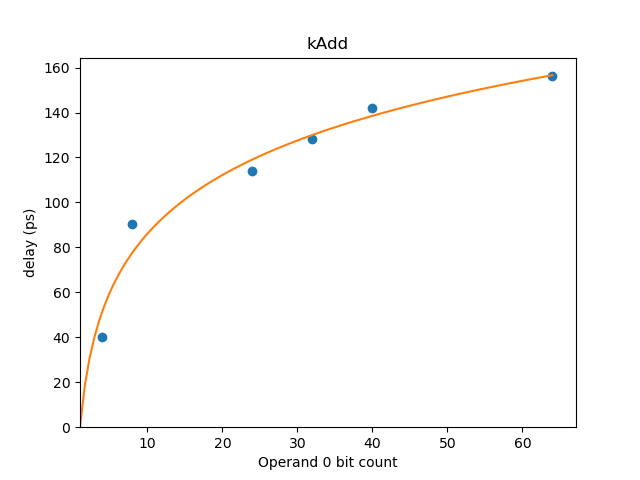

# Delay Estimation Methodology

## Context

This doc describes the delay estimation methodology used in XLS and related
background.

Estimating delays through networks of CMOS gates is a rich topic, and Static
Timing Analysis (STA) is used in chip backend flows to ensure that, even for
parts operating at the tail end of the distribution, chips continue to function
as specified logically in the netlist.

In stark contrast to something with very concrete constraints, like a
"post-global routing, high-accuracy parasitics static timing analysis", the HLS
tool needs to estimate at a high level, reasonably near to the user's behavioral
specification, what delay HLS operations will have when they are "stacked on
top" of each other in a data dependent fashion in the design.

This information lets the HLS tool schedule operations into cycles without
violating timing constraints; e.g. if the user specifies 1GHz (= 1000ps) as
their target clock frequency, the HLS tool may choose to pack as much data
dependent work into the 1000ps budget (minus clock uncertainty) as it can on any
given cycle.

Although what we're estimating is a close relative of Static Timing Analysis,
the fact it's being analyzed at a very high level presents a different set of
tradeoffs, where **coarse granularity estimation** and **conservative bounds**
are more relevant. Fine-grained / precise analyses are used later in the chip
design process, in the backend flows, but the HLS tool acts more like an RTL
designer, creating an RTL output that early timing analysis deems acceptable.

Notably, we don't want to be *too* conservative, as being conservative on timing
can lead to designs that take more area and consume more power, as the flops
introduced by additional pipeline stages are significant. We want to be as
accurate as possible while providing a good experience of being able to close
timing quickly (say, in a single pass, or with a small number of iterations in
case of a pathological design).

## Background

### What XLS is compiling

XLS currently supports feed-forward pipelines -- once the user program is
unrolled into a big "sea of nodes" we must schedule each of those operations
(represented by nodes) to occur in a cycle.

It seems clear that an operation like `add(bits[32], bits[32]) -> bits[32]`
takes some amount of time to produce a result -- we need to be able to determine
what that amount of time is for packing that operation into a given cycle.
<sup>[1](#footnote1)</sup> Note that XLS operations are parametric in their
bitwidth, so `add(bits[17], bits[17]) -> bits[17]` is just as possible as a
value like `32`. This ain't C code.

<a name='footnote1'>1</a>: Note that we currently pack operations into cycles
atomically -- that is, we don't break an `add` that would straddle a cycle
boundary into `add.first_half` and `add.second_half` automatically to pull
things as early as possible in the pipeline, but this is future work of
interest. Ideally operations would be described structurally in a way that could
automatically be cut up according to available delay budget. This would also
permit operations in the IR that take more than a single cycle to produce a
value (currently they would have to be "legalized" into operations that fit
within a cycle, but that is not yet done, the user will simply receive a
scheduling error).

Some operations, such as `bit_slice` or `concat` are just wiring "feng shui";
however, they still have some relevance for delay calculations! Say we
concatenate a value with zeros for zero extension. Even if we could schedule
that in "cycle 0", if the consumer can only be placed in "cycle 1", we would
want to "sink" the concat down into "cycle 1" as well to avoid unnecessary
registers being materialized sending the zero values from "cycle 0".

### The delay problem

Separately from XLS considerations, there are fundamental considerations in
calculating the delay through clouds of functional logic in (generated) RTL.

Between each launching and capturing flop is a functional network of logic
gates, implemented with standard cells in our ASIC process flows. Chip designs
target a particular clock frequency as their operating point, and the functional
network has to produce its output value with a delay that meets the timing
constraint of the clock frequency. The RTL designer typically has to iterate
their design until:

timing path delay \<= target clock period - clock uncertainty

For all timing paths in their design, where clock uncertainty includes
setup/hold time constraints, and slop that's built in as margin for later
sources of timing variability (like instantiating a clock tree, which can skew
the clock signal observed by different flops).

In a reasonable model, gate delay is affected by a small handful of properties,
as reflected in the "(Method of) Logical Effort" book:

-   The transistor network used to implement a logic function (AKA logical
    effort): on an input pin change, the gate of each transistor must be driven
    to a point it recognizes whether a 0 or 1 voltage is being presented. More
    gates to drive, or larger gates, means more work for the driver.
-   The load being driven by the logic function (AKA electrical effort): fanning
    out to more gates generally means more work to drive them all to their
    threshold voltages. Being loaded down by bigger gates means more work to
    drive it to its threshold voltage.
-   Parasitic delays: RC elements in the system that leech useful work,
    typically in a smaller way compared to the efforts listed above.

The logical effort book describes a way to analyze the delays through a network
of gates to find the minimal delay, and size transistors in a way that can
achieve that minimal delay (namely by geometrically smoothing the ability for
gate to drive capacitance).

Confounding factors include:

-   Medium/large wires: sizing transistors to smooth capacitance becomes
    difficult as fixed-capacitance elements (wires) are introduced. It seems
    that small wires have low enough capacitance they can generally be treated
    as parasitic.
-   Divergence/reconvergence in the functional logic network (as a DAG).
    Different numbers of logic levels and different drive currents may be
    presented from different branches of a fork/join the logic graph, which
    forces delay analysis into a system of equations to attempt to minimize the
    overall delay, as observed by the critical path, with transistor sizing and
    gate choices. (Some simplifications are possible, like buffering
    non-critical paths until they have the same number of logic levels so they
    also have plenty of current to supply at join points.)

Somewhat orthogonal to the analytical modeling problem, there are also several
industry standards for supplying process information to Static Timing Analysis
engines for determining delay through a netlist. This information is often given
in interpolated tables for each standard cell, for example in the NLDM model
describing how delay changes as a function of input transition time and load
(load capacitance).

These models and supplied pieces of data are important to keep in mind for
contrast, as we now ignore it all and do something very simple.

## Simple Delay Estimation

Currently, XLS delay estimation follows a conceptually simple procedure:

-   For every operation in XLS (e.g. binary addition):

    -   For some relevant-seeming set of bitwidths; e.g. `{2, 4, 8, 16, ...,
        2048}`
    -   Find the maximum frequency at which that operation closes timing at that
        bitwidth, in 100MHz units as determined by the synthesis tool.
        <sup>[2](#footnote2)</sup> Call the clock period for this frequency
        `t_best`. (Note that we currently just use a single process corner /
        voltage for this sweep.)
    -   Subtract the clock uncertainty from `t_best`.
    -   Record that value in a table (with the keys of the table being operation
        / bitwidth).

<a name='footnote2'>2</a>: The timing report can provide the delay through a
path at any clock frequency, but a wrinkle is that synthesis tools potentially
only start using their more aggressive techniques as you bump up against the
failure-to-close-timing point -- there it'll be more likely to change the
structure of the design to make it more delay friendly. The sweep helps to try
to cajole it in that way.

Inspecting the data acquired in this way we observe all of the plots consist of
one or more the following delay components:

-   Constant as a function of bitwidth for a given op (e.g. binary-or just
    requires a single gate for each bit regardless of the width of the inputs).
-   Logarithmic as a function of bitwidth (e.g. adders may end up using
    tree-like structures to minimize delay, single-selector muxes end up using a
    tree to fan out the selector to the muxes, etc.).
-   Linear as a function of bitwidth (e.g., ripple-carry adders and some
    components of multipliers).

So given this observation we fit a curve of the form:

```
a * bitwidth + b * log_2(bitwidth) + c
```

to the sweep data for each operation, giving us `(a, b, c)` values to use in our
XLS delay estimator.

The utility `delay_model_visualizer` under the `tools` directory renders a graph
of the delay model estimate against the measured data points. This graph for add
shows a good correspondence to the measured delay.



### Sweeping multiple dimensions

Operations with attributes in addition to bitwidth that affect delay are swept
across multiple dimensions. An example is `Op::kOneHotSelect` which has
dimensions of bitwidth and number of cases. For the `Op::kOneHotSelect` example
the formula is:

```
a * bitwidth + b * log_2(bitwidth) + c * (# of cases) + d * log_2(# of cases) + c
```

Below is plot of delay for `Op::kOneHotSelect` showing the two dimensions of
bitwidth and operand count affecting delay:


### Sources of pessimism/optimism

This simple method has both sources of optimism and pessimism, though we hope to
employ a method that will be generally conservative, so that users can easily
close timing and get a close-to-best-achievable result (say, within tens of
percent) with a single HLS iteration.

Sources of pessimism (estimate is conservative):

-   The operation sweeps mentioned are not bisecting to the picosecond, so there
    is inherent slop in the measurement on account of sweep granularity.
-   We expect, in cycles where multiple dependent operations are present, there
    would be "K-map style" logic reductions with adjacent operations. For
    example, because we don't do cell library mapping in XLS delay estimation,
    something a user wrote that mapped to an AOI21 cell would be the sum of
    (and+or+invert) delays.
-   [Unsure] May there be additional logic branch splitting options and
    earlier-produced results available to the synthesis tool when there are more
    operations in the graph (vs a lone critical path measured for a single
    operation)?

Sources of optimism (estimate is overeager):

-   For purposes of the sweep the outputs of an operation are only loaded by a
    single capture flop flop -- when operations have fanout the delay will
    increase.

    Note that we do account for fanout *within* individual operations as part of
    this sweep; e.g. a 128-bit selector fanout (e.g. 128 ways to 128 muxes) for
    a select is accounted for the in delay timing of the select operation. It is
    the *output* logic layer that is only loaded by a single flop in our
    characterization. Notably because most of these operations turn into trees
    of logic, there are $$log_2(bitcount)$$ layers of logic in which we can
    potentially smoothly increase drive strength out to the output logic layer,
    and paths can presumably be replicated by synthesis tools to reduce
    pointwise fanout when multiple high-level operations are data-dependent
    within a cycle. (Is it *possible* for a user to break up their 32-bit select
    into bitwise pieces in their XLS code to mess with our modeling? Sure, but
    probably not too expected, so we're currently sort of relying on the notion
    people are using high level operations instead of compodecomposing them into
    bitwise pieces in our graph.)

    A potential way to reconcile this output fanout in the future is to do a
    delay sweep with a high-capacitive fanout (e.g. four flops of load) and then
    ensure the IR has a maximum fanout of four for our delay estimation.

-   Wiring delay / load / congestion / length are not estimated. This will need
    additional analysis / refinement as we run XLS through synthesis tools with
    advanced timing analysis, as it is certainly not viable for arbitrary
    designs (tight pipelines may be ok for now, though).

### Iterative refinement

The caveats mentioned above seem somewhat daunting, but this first cut approach
appears to work *comfortably* at target frequenties, in practice, for the
real-world blocks being designed as XLS "first samples".

Notably, human RTL designers fail to close timing on a first cut as well -- HLS
estimations like the above assist in getting a numeric understanding (in lieu of
an intuitive guess) of something that may close timing on a first cut. As this
early model fails, we will continue to refine it; however, there is also a
secondary procedure that can assist as the model improves.

Let's call the delay estimation described above applied to a program a
*prediction* of its delays. Let's call the first prediction we make `p0`: `p0`
will either meet timing or fail to meet timing.

When we meet timing with `p0`, there may be additional wins left on the table.
If we're willing to put synthesis tool runs "in the loop" (say running a "tuner"
overnight), we can refine XLS's estimates according to the realities of the
current program, and, for example, try to squeeze as much as possible into as
few cycles as possible if near-optimality of latency/area/power were a large
consideration. This loop would generate `p1`, `p2`, ... as it refined its model
according to empirical data observed from the synthesis tool's more refined
analysis.

When we fail to close timing with `p0`, we can feed back the negative slack
delays for comparison with our estimates and relax estimates accordingly.
Additionally, an "aggression" knob could be implemented that backs off delay
estimations geometrically (say via a "fudge factor" coefficient) in order to
ensure HLS developer time is not wasted unnecessarily to ensure. Once a
combination of these mechanisms has obtained a design that closes timing, the
"meeting timing, now refine" procedure can be employed as described above.

### On Hints

To whatever extent possible, XLS should *be* the tool that reasons about how to
target the backend (vs having a tool that sits on top of it and messes with XLS'
input in an attempt to achieve a result). User-facing hint systems are typically
very fragile, owing to the fact they don't have easily obeyed semantics. XLS, by
contrast, knows about its own internals, so can do things with awareness of
what's happened upstream and what remains to happen downstream.

By contrast, we **should** continue to add ways for users to provide more
semantic information / intent as part of their program (e.g. via more high-level
patterns that make high level structure more clear), and make XLS smarter about
how to lower those constructs into hardware (and why it should be lowering them
that way) in the face of some prioritized objectives (power/area/latency).

That being said, because we're probably trying to produce hardware at a given
point in time against a given technology, it likely makes sense to permit human
users to specify things directly (at a point in time), even if those
specifications might be ignored / handled very differently in the future or
against different technology nodes. This would be the moral equivalent of what
existing EDA tools do as a "one-off TCL file" used in a particular design, vs
something carried from design to design. Recall, though, that the intent of XLS
is to make things easier to carry from design to design and require fewer
one-off modifications!

## Tools

XLS provides tools for analyzing its delay estimation model. (Note that the
given IR should be in a form suitable for code generation; e.g. it has run
through the `opt_main` binary).

```
$ bazel run -c opt //xls/dev_tools:benchmark_main -- $PWD/bazel-bin/xls/examples/crc32.opt.ir --clock_period_ps=500 --delay_model=sky130
<snip>
Critical path delay: 8351ps
Critical path entry count: 43
Critical path:
   8351ps (+ 21ps): not.37: bits[32] = not(xor.213: bits[32], id=37, pos=[(0,30,51)])
   8330ps (+128ps): xor.213: bits[32] = xor(concat.203: bits[32], and.222: bits[32], id=213, pos=[(0,25,19)])
   8202ps (+ 81ps): and.222: bits[32] = and(mask__7: bits[32], literal.395: bits[32], id=222, pos=[(0,25,33)])
   8121ps (+621ps)!: mask__7: bits[32] = neg(concat.199: bits[32], id=202, pos=[(0,24,15)])
   7330ps (+  0ps): concat.199: bits[32] = concat(literal.387: bits[31], bit_slice.198: bits[1], id=199, pos=[(0,24,21)])
   7330ps (+  0ps): bit_slice.198: bits[1] = bit_slice(xor.196: bits[32], start=0, width=1, id=198, pos=[(0,24,21)])
   7330ps (+128ps): xor.196: bits[32] = xor(concat.194: bits[32], and.221: bits[32], id=196, pos=[(0,25,19)])
   7202ps (+ 81ps): and.221: bits[32] = and(mask__6: bits[32], literal.394: bits[32], id=221, pos=[(0,25,33)])
<snip>
```

In addition to the critical path, the cycle-by-cycle breakdown of which
operations have been scheduled is provided in stdout.
