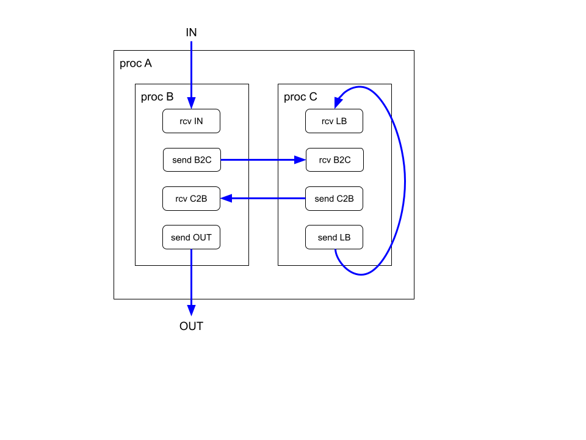
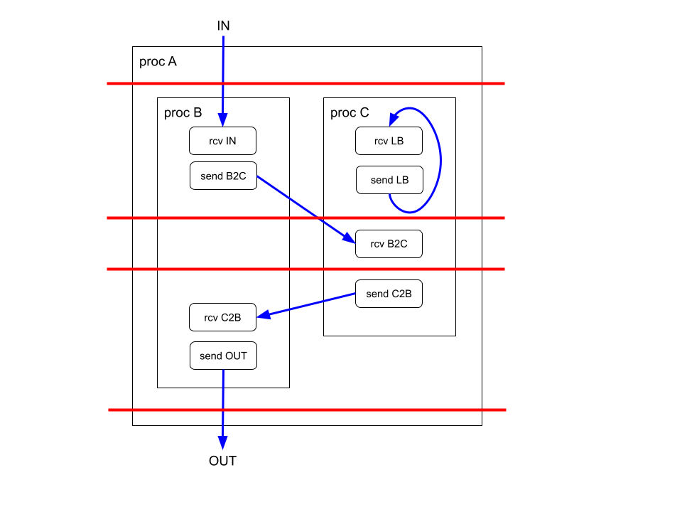

# Synchronous Procs in XLS

[TOC]

## Proposal

This document proposes an alternate implementation of procs based on synchronous
data flow, a restriction of Kahn process networks where the communication
behavior over channels is known statically. This synchronous implementation,
accomplished via changes to scheduling and codegen, offers a number of usability
and QoR advantages relative to our current asynchronous implementation:

*   Channel flow control (ready and valid signals) and the associated logic can
    be eliminated. This improves QoR and avoids combinational cycles which can
    occur when developing networks of procs.
*   The throughput of the proc network can be guaranteed by the scheduler rather
    than relying on the user to coordinate the relative timing of sends and
    receives across procs to achieve a target throughput and avoid deadlocks.
*   Under certain conditions channels can be replaced with wires enabling
    scheduling stages to span proc boundaries which increases scheduling
    flexibility and can improve QoR (latency and area).

Conceptually, synchronous procs are scheduled together into a single pipeline
rather than as separate communicating pipelines. Little or no changes to the
DSLX code are necessary and behavior is preserved relative to the asynchronous
implementation excepting scheduling dependent ordering and quirks in the
existing codegen implementation.

Synchronous data flow requires that channel communication is known statically.
In the XLS context this means that the predicates of send and receive operations
are predictable (specific conditions are detailed below). A simple, sufficient
condition is that all sends and receives are un-predicated. This document
focuses on this case although relaxation of this constraint is likely possible.
A further simplification assumed here (again, likely relaxable) is that all
procs have an initiation interval of one, i.e. full throughput.

Under these two conditions the scheduling of the nodes of the network of procs
can be formulated as a single global scheduling problem. The scheduler
statically resolves the relative timing of sends and receives without the need
for channel flow control and ensures full throughput. The scheduling problem can
be formulated as follows:

*   All nodes of all procs are collectively scheduled in a single formulation.
*   Feed-forward channels are treated as regular data flow edges similar to an
    edge between nodes within a proc or function.
*   Send and receive nodes of loopback channels[^1] require scheduling
    constraints specifying a maximum schedule distance between the nodes. The
    schedule distance must be less than the number of initial values in the
    channel to guarantee full throughput.

The nodes of all of the procs along with the edges defined by channels is the
global data flow graph. The scheduler operates on the global data flow graph and
assigns a global stage number to every node. To generate pipelines for each
proc, the global stage number is mapped to a proc-relative stage number by
subtracting the earliest global stage of any node in the proc. These
proc-relative stage numbers are used by codegen to generate the proc pipeline as
with the existing codegen. Unlike existing codegen, no channel flow control
logic needs to be generated. Stage activation logic can be simplified to a
feed-forward valid signal (the case is more complicated if the synchronous
system can stall, see below)

Feed-forward channels are implemented as wires or a sequence of one or more
registers depending on the schedule distance between the send and receive nodes.
If scheduled in the same global stage, the channel is a wire. If scheduled in
different stages the channel is implemented as a sequence of pipeline registers
(the send is necessarily scheduled before the receive as this is a feed-forward
channel). This is identical to the way regular node-to-node dataflow edges are
handled. loopback channels are implemented as a FIFO with one or more initial
values.

As in the asynchronous case, the proc pipelines are instantiated hierarchically
and connected by the respective channel implementations (wires, registers, or
FIFOs) to produce the synchronous implementation.

## Example

Consider a simple proc hierarchy where a top-level proc A instantiates two
subprocs B and C. The internal logic of the procs is abstracted away and only
the channel communication is shown. Channels IN and OUT are input/output
channels of the design. Channels B2C and C2B are for interproc communication and
channel LB is a loopback channel. The procs may be stateful or stateless.

Similar to the case of scheduling (pipelining) a single function or proc, the
location of pipeline registers can be represented as cuts through the data flow
graph. In the case of synchronous procs, these cuts extend through the global
data flow graph and potentially cut across multiple procs. In the example, the
following might be a possible schedule of the design with pipeline register
locations shown as red lines:

The design is pipelined into five stages separated by four sets of pipeline
registers.

Similar to normal dataflow edges, if a channel edge spans a pipeline boundary a
pipeline register is introduced. For example, channel B2C is represented as a
register. However, channel C2B which does not span a boundary is represented as
a wire. A channel edge could also span multiple pipeline boundaries in which
case the channel would be represented with multiple registers.

The loop back channel LB is represented as a single register with a reset value
equal to the initial value of the channel. If the channel requires multiple
initial values because it spans multiple cycles then an initial constraint on
the implementation could be that all initial values must be the same (which
becomes the reset value of the register representing the channel).

Non-channel nodes are handled as in the single proc/function case. In the above
example, non-channel nodes may appear in any of the stages.

## Behavior vs asynchronous implementation

Systems of synchronous procs produce the same results (ie, values written on
output channels) as asynchronously implemented procs[^2] because the synchronous
data flow model is just a specialization of Kahn process networks and has the
same deterministic result guarantees. However, the specific timing of send and
receive operations may be different. The specific send and receive operations
whose executions are tied together may also differ. For the simple case of full
throughput with un-predicated send and receives the bundling and ordering of
operations is immaterial as all sends and receives execute every cycle excepting
pipeline ramp-up.

## Comparison vs single proc implementation with functions

Any hierarchy of procs can be implemented as a single proc[^3] with composition
and reuse handled via function invocation. In the current XLS flow, all function
invocations are inlined so some of the benefits of synchronous procs can be
captured with function invocation:

*   Feed-forward channels in the multi-proc design become regular node-to-node
    data flow edges in the single-proc design so there is no internal flow
    control and these edges need not align with cycle boundaries.
*   Proc throughput is guaranteed by the scheduler. The user does not need to
    coordinate channel communication across procs as this communication becomes
    regular data flow edges in a single proc design.

Implementing the design as a single proc with functions also has at least one
advantage over synchronous procs which is the scope of existing analyses and
optimizations is the entire design after function inlining.

However, implementing the design as a single proc also has some notable
disadvantages:

*   Some subcomponents of the design may more naturally be represented as procs
    with state and/or channel communication. In a single proc design, state and
    channel communication must be hoisted to the top level.
*   The design hierarchy is flattened and the entire design becomes a single
    (potentially very large) RTL module. This may be detrimental to downstream
    flows such as DV and PD[^4] as well as adversely affecting the readability
    of the RTL in general.
*   All of the code being in a single unit can cause XLS toolchain scaling
    problems. This can cause unacceptably slow analysis, optimization, and other
    processes such as LLVM JIT compilation. Some of the current implementations
    of these processes (such as the block JIT) do not take advantage of a
    hierarchically decomposed design but that is a current implementation
    limitation and something we may wish to fix in the future.

Some of these drawbacks might be mitigated by not inlining all functions and
handling function invocation all the way through codegen.

## Extensions and generalizations

### Initiation interval greater than one

The simplest generalization beyond full throughput is all procs having the same
initial interval which is greater than one. In this case, loopback channel
constraints (the number of required initial values) may change, but the global
scheduling formulation should work without modification. A more complicated
generalization is a mixed initiation interval design. The details of this
generalization are TBD.

### Predicated sends and receives

A relatively easy generalization allowing some predication is if the send and
receive operation on a particular channel always have identical predicate values
for the same activation[^5]. That is, the send fires if and only if the receive
fires. This could be checked statically for simple cases or checked dynamically
via asserts. In this case, no changes are needed to the implementation described
above.

Supporting cases where the send and receive predicates can be different is more
complicated. Because there is no flow control the writing and reading of values
to the channel must be precisely orchestrated to avoid losing data. This is a
hard problem in general to analyse across the stateful evolution of the system
but might be possible for special cases.

### Multiply instantiated procs

Multiply instantiated procs pose complications for scheduling because the
schedule of the proc must satisfy the scheduling constraints at each point at
which it is instantiated. For some common situations such as a proc which is
instantiated multiple times in parallel the additional constraints may be easy
to satisfy. For more complicated situations, the proc can be cloned to avoid
multiple instantiations.

### Pipeline flow control

The synchronous implementation as described above has no flow control. The
implementation expects all inputs to the design to be valid and all outputs to
be ready every cycle. This enables unconditional, full-throughput execution.
These constraints on input valid / output ready can be relaxed if pipeline flow
control (e.g., bubble flow control) is added to the synchronous implementation.
This eases the incorporation of the synchronous implementation into asynchronous
systems because the pipeline will stall if no input is available and
backpressure if unable to write outputs.

The logic for pipeline flow control for the global pipeline in the synchronous
system is the same as for the pipeline of a single proc or function in the
existing XLS implementation. The difference in the synchronous system of procs
is that a stage can span multiple procs so wiring the flow control logic is more
complicated. This is not theoretically difficult but requires additional work in
codegen.

### Synchronous procs within asynchronous system of procs

If a synchronous system of procs has pipeline flow control, then the system of
procs can be embedded within a larger system of asynchronous procs.
Conceptually, this results in a synchronous domain within an asynchronous
domain. The execution of send and receive operations which are scheduled in the
same global stage (potentially in different procs) will be bundled together
similar to the way these operations are bundled within a stage of a single proc
in the current codegen implementation. As with the single-proc case this
bundling may cause problems such as deadlocks depending upon the expectations of
the asynchronous system. The notion of a synchronous domain within an
asynchronous system is not a new concept in XLS. Currently, a single proc within
a proc network can be thought of as a synchronous domain (the nodes of the proc
are synchronously scheduled) within an asynchronous domain (the proc network).

### Broadcasting operations on channels

Although not currently in use or fully defined, broadcast operations where a
single send communicates to multiple receives can be handled easily with
synchronous procs if the channel is a feed-forward channel. Feed-forward
channels become normal data flow edges with synchronous procs so a broadcast is
treated identically to a node with multiple users.

[^1]The definition of forward and back edges may not be unique in a directed
graph because the categorization of edges depends on the DFS traversal order.
This suggests that unambiguous identification of feed-forward and loopback
channels may not be possible, however <hypothesis> the conditions that no nodes
both send and receive on channels and all regular data flow edges are forward
edges means loopback channels can be unambiguously identified </hypothesis>.

[^2]This does not include procs with latency-sensitive behavior such as
non-blocking receive operations.

[^3]The design could also be implemented as a small number of procs with most
composition done using function invocation and the same arguments would apply.

[^4]One potential problem in PD is attribution of PPA problems. The hierarchy
narrows down where the problems occur in the source code.

[^5]Though the send and receive may be in different procs with a synchronous
system there is a notion of a global activation because all the iteration of all
procs is coupled.
