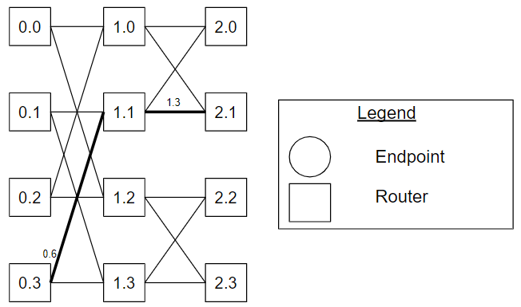
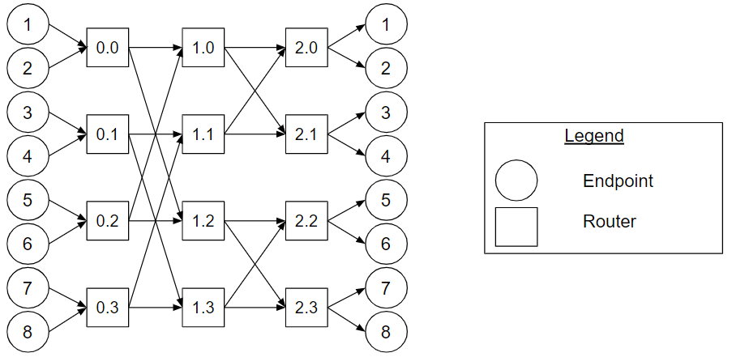
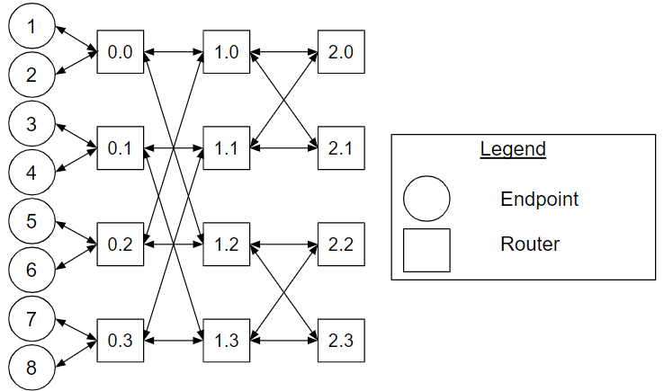
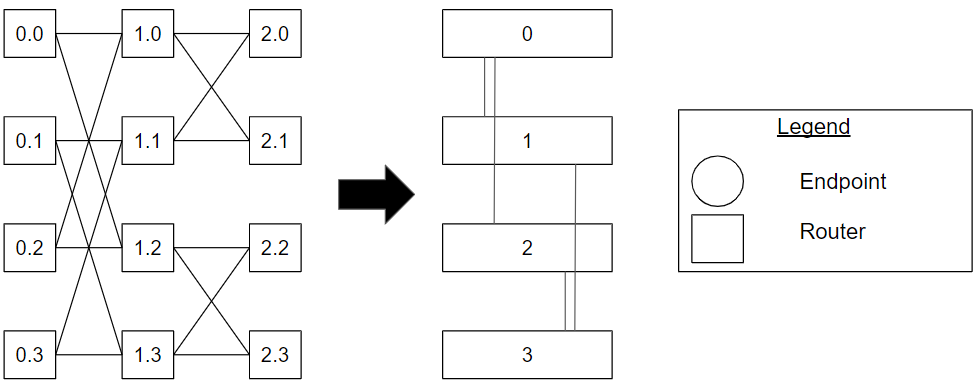

# k-ary n-fly Butterfly Topology Types

## Overview 

A _k_-ary _n_-fly butterfly topology type is a multistage logarithm network. It
is implemented using _n_ stages of identical routers, where _k_ is the number of
channels of a router that connect to the previous and/or to the next stage. For
example, a 2-ary 3-fly butterfly topology has three stages composed of routers
with two channels connect to the routers of the previous and/or the next stage
(see Figure Butterfly_Topology_Example).

Each endpoint node and channel has an _n_-digit radix\-_k_ identifier,
{dn−1, dn−2, ..., d0}. The first _n−1_ digits
{dn−1, dn−2, ..., d1} of the identifier
corresponds to the router that it is connected to. Each router node has an
_n−1_-digit radix\-_k_ identifier. To distinguish nodes and channels from
different stages, the stage number is appended to their identifier separated by
a period. For example, for a 2-ary 4-fly butterfly network: 2.10102
is channel 1010 from stage 2. **[Butterfly_Ref_0](#butterfly_ref_0)**

The connection between the stages is a permutation of the channel identifier.
The connection of a channel from stage _i_-1 to stage _i_ swaps digits
dn−i and d0 of the channel identifier, with _i_ >= 1 and
_i_ &lt; n. For example, for a 2-ary 4-fly butterfly network: channel
910 of stage 1 [1.10012] is connected to router 4
[1.<strong>100</strong>12] of stage 1 and router 6
[2.<strong>110</strong>02] of stage 2.
**[Butterfly_Ref_0](#butterfly_ref_0)**

**Figure Butterfly_Topology_Example. The
router nodes of a 2-ary 3-fly butterfly topology.**

Figure [Butterfly_Topology_Example](#butterfly_topology_example) shows the
router nodes of a 2-ary 3-fly butterfly topology. The routers are labelled with
an **S.I** format where **S** is the stage identifier and **I** is the router
identifier. For example, router 0.2 is router 2 from stage 0. Channel 0.6 is
connected to router 3 [0.<strong>11</strong>02] of stage 0 and router
1 of stage 1 [1.<strong>01</strong>12], Channel 1.3 is connected to
router 1 [1.<strong>01</strong>12] of stage 1 and to router 1
[1.<strong>01</strong>12] of stage 2.

## Unidirectional Types 

For the unidirectional type of the _k_-ary _n_-fly, there are endpoints
connected to stage 0 and stage
_n_-1. There are two configurations: 1) the endpoints connected to stage 0 send
to the network, and the endpoints connected to stage _n_-1 receive from the
network, and 2) the endpoints connected to stage 0 receive from the network, and
the endpoints connected to stage _n_-1 send to the network. A unidirectional
_k_-ary _n_-fly butterfly topology has at most _kn_ endpoints
connected to stage 0 and at most _kn_ endpoints connected to stage
_n_-1. Typically, the endpoints nodes connected to stage 0 and stage _n_-1 are
the same nodes, resulting in an equal number of nodes connected to stage 0 and
stage _n_-1. Moreover, the endpoints nodes are connected to stage 0 in the same
order as stage _n_-1 (mirrored from the vertical cross section).

**Figure
Unidirectional_Butterfly_Topology_Example.
A 2-ary 3-fly butterfly with the endpoints connected to stage 0 sending to the
network, and the endpoints connected to stage 2 receiving from the network
example.**

Figure
[Unidirectional_Butterfly_Topology_Example](#unidirectional_butterfly_topology_example)
shows a 2-ary 3-fly butterfly with the endpoints connected to stage 0 sending to
the network, and the endpoints connected to stage 2 receiving from the network
example.

## Bidirectional Types 

In the bidirectional type, there are endpoints connected to stage 0
or stage _n_-1. A bidirectional
_k_-ary _n_-fly butterfly topology has at most _kn_ endpoints
connected to stage 0 or stage _n_-1. A bidirectional _k_-ary _n_-fly butterfly
topology with the endpoints connected to stage _n_-1 is also referred to as the
_k_-ary _n_-fly fat tree butterfly topology or _k_-ary _n_-tree butterfly fat
tree topology **[Fat_Tree_Ref_0](#fat_tree_ref_0)**.

For context, minimal routing between a pair of nodes on a bidirectional k-ary
n-tree can be accomplished by sending the message to one of the nearest common
ancestors of both source and destination and from there to the destination. That
is, each message experiences two phases, an ascending phase to get to a nearest
common ancestor, followed by a descending phase.
**[Fat_Tree_Ref_1](#fat_tree_ref_1)**

**Figure
Bidirectional_Butterfly_Topology_Example.
A bidirectional 2-ary 3-fly butterfly with the endpoints connected to stage 0
example.**

Figure
[Bidirectional_Butterfly_Topology_Example](#bidirectional_butterfly_topology_example)
shows a bidirectional 2-ary 3-fly butterfly with the endpoints connected to
stage 0 example.

## Cheat Sheet

*   [_k_-ary _n_-flies](#butterfly) are implemented by using _n_ stages of
    identical routers, where _k_ is the number of channels of a router that
    connect to the previous and/or to the next stage.
*   For unidirectional [_k_-ary _n_-fly](#unidirectional_butterfly), there are
    endpoints connected to stage 0
    and stage _n_-1. The
    communication flows from stage 0 to stage _n_-1
    or from stage _n_-1 to
    stage 0.
*   For bidirectional [_k_-ary _n_-fly](#bidirectional_butterfly), there are
    endpoints connected to stage 0
    or stage _n_-1. The
    communication flows from stage 0 to stage _n_-1
    and from stage _n_-1 to
    stage 0.

## Variants

This section describes variants to the _k_-ary _n_-fly butterfly topology.

### Flattened Butterfly

The flattened butterfly is derived by flattening the routers in each row of a
conventional butterfly topology while maintaining the same inter-router
connections. **[Butterfly_Ref_1](#butterfly_ref_1)**

**Figure
Flattened_Butterfly_Topology_Example.
An example of a 2-ary 3-fly butterfly and its corresponding flattened butterfly
topology.**

Figure
[Flattened_Butterfly_Topology_Example](#flattened_butterfly_topology_example)
shows an example of a 2-ary 3-fly butterfly and its corresponding flattened
butterfly topology. For each row, routers from stage 0, 1 and 2 are flattened
into individual routers. For example, router 0.0, 1.0 and 2.0 are flattened into
router 0.

### Endpoint Connections

As mentioned, typically, for the unidirectional butterfly topology, the
endpoints nodes are connected to stage 0 in the same order as stage _n_-1
(mirrored from the vertical cross section). However, different topologies are
said to emerge by modifying the order of the endpoint nodes connected to the
network. Such a change in connectivity may also change the routing algorithm.
Ludovici et al present a Reduced Unidirectional Fat Tree derived from a k-ary
n-fly topology. **[Fat_Tree_Ref_0](#fat_tree_ref_0)**

## References

**[Butterfly_Ref_0]** William James Dally and Brian
Patrick Towles. 2004. Principles and Practices of Interconnection Networks.
Morgan Kaufmann Publishers Inc., San Francisco, CA, USA.

**[Fat_Tree_Ref_0]** D. Ludovici et al., "Assessing
fat-tree topologies for regular network-on-chip design under nanoscale
technology constraints," 2009 Design, Automation & Test in Europe Conference &
Exhibition, Nice, 2009, pp. 562-565, doi: 10.1109/DATE.2009.5090727.

**[Fat_Tree_Ref_1]** F. Petrini and M. Vanneschi,
"k-ary n-trees: high performance networks for massively parallel architectures,"
Proceedings 11th International Parallel Processing Symposium, Genva,
Switzerland, 1997, pp. 87-93, doi: 10.1109/IPPS.1997.580853.

**[Butterfly_Ref_1]** J. Kim, J. Balfour and W.
Dally, "Flattened Butterfly Topology for On-Chip Networks," 40th Annual IEEE/ACM
International Symposium on Microarchitecture (MICRO 2007), Chicago, IL, 2007,
pp. 172-182, doi: 10.1109/MICRO.2007.29.
