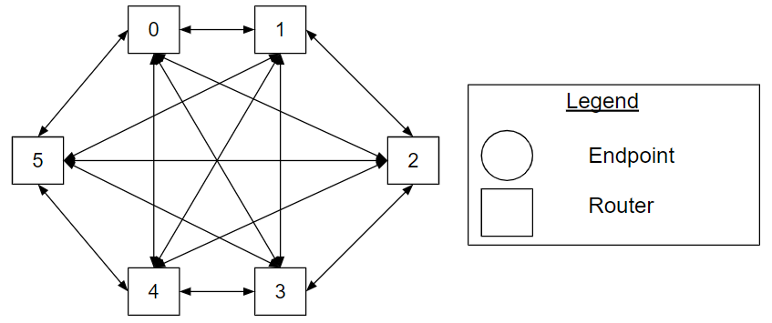

# Fully-connected Topology Types 

The fully-connected topology is a topology where each router has a bidirectional
channel connecting it to each remaining router of the topology. One or more
endpoint nodes are connected to a router.

**Figure Fully_Connected_example. A
fully-connected topology with six routers.**

Figure [Fully_Connected_example](#fully_connected_example) shows a
fully-connected topology with six routers.

## Cheat Sheet

*   The [fully-connected](#fully_connected) topology is a topology where each
    router has a bidirectional connecting it to each remaining router of the
    topology.
