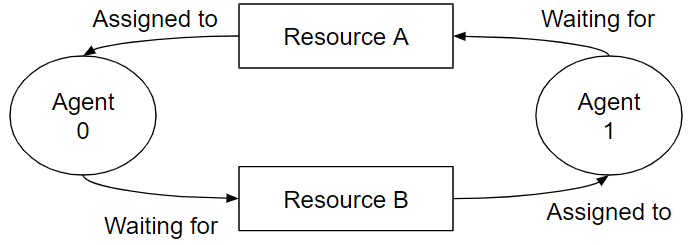
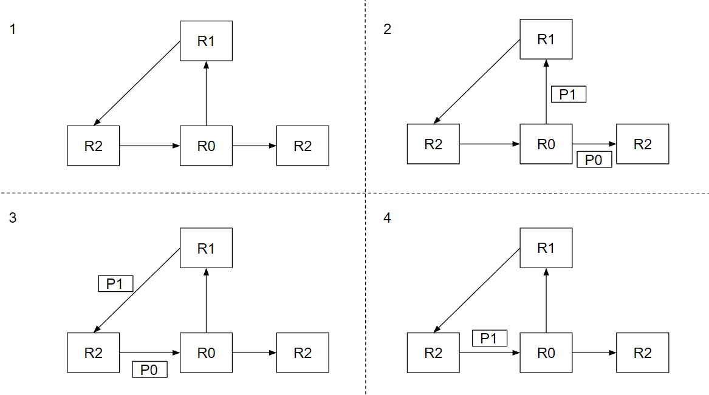

# XLS-NoC Glossary

## Adaptive Routing

An adaptive [routing algorithm](#routing_algorithm) derives a route using any
information about the network’s state.

## Channel

A channel interconnects a pair of nodes and is the medium that transfers data
amongst the pair. A node is either a router input, a router output or an
endpoint port. A channel may be unidirectional, transferring the data in a
single direction, or bidirectional, transferring the data in both directions.

## Endpoint

A node connected to the network that communicates to other endpoints using the
network.

## Endpoint Port

An endpoint port is a port that connects to an endpoint. There are two types of
endpoint ports: a send port and a receive port. A send port enables an endpoint
to send data to the network and a receive port enables an endpoint to receive
data from the network. The naming convention for a send port and receive port is
from the perspective of the endpoints.

## Deadlock

A deadlock occurs when a set of agents holding resources are waiting on another
set of resources such that a cycle of waiting agents is formed, implying that
agents are unable to make progress.

**Figure Deadlock_Example. A deadlock example with
two agents and two resources.**

Figure [Deadlock_Example](#deadlock_example) shows a deadlock example with two
agents and two resources. In the example, agent 0 is waiting for resource B that
is assigned to agent 1, and agent 1 is waiting for resource A that is assigned
to agent 0. The dependency cycle created with agent 0 and 1 demonstrate that the
agents are unable to make progress.

## Flit

A flow control digit, or flit, is the smallest unit of resource allocation in a
router. Variable length packets are divided into one or more fixed length flits
to simplify the management and allocation of resources. Flits may be divided
further into phits when traversing a router.

## Flow Control

Flow control is the scheduling and allocation of a network’s resources. For
example, a [virtual channel](#virtual_channel) can have a
[wormhole flow control](#wormhole_flow_control).

## Hotspot (Hot-spot)

A hotspot resource is one whose demand is significantly greater than other,
similar resources. For example, a particular destination terminal becomes a
hotspot in a shared memory multicomputer when many processors are simultaneously
reading from the same memory location (for example, a shared lock or data
structure). Another example is traffic congestion within an area of the network.

## Livelock

Livelock occurs when a packet is not able to make progress in the network and is
never delivered to its destination. Unlike deadlock, a livelocked packet
continues to move through the network.

**Figure Livelock_Example. A example with
livelocked packet P1.**

Figure [Livelock_Example](#livelock_example) shows a livelock example. In the
example, there are two packets, P0 and P1. The destination router for the
packets is router R2. R1 uses an [adaptive routing](#adaptive_routing)
algorithm. At timestep 1, P0 and P1 are at router R0. Given the routing
algorithm at R0, R0 routes packet P0 to R2 and P1 to R1 (timestep 2). At
timestep 3, another instance of P0 is routed to R0 and P1 is routed to R2. At
timestep 4, P1 is routed to R0. After the arrival of P1 at R0. The state of R0
is identical to timestep1 where these sequence of events will repeat. In the
end, P1 does not arrive to its destination although it makes progress, thus
livelocked.

## Network-On-Chip (NoC)

At a high level, a Network-On-Chip (NoC) is a network designed for one chip. It
is composed of routers, channels and endpoint ports. It transports data between
endpoints connected to it. Although the design is intended for a single chip,
the logical description can be partitioned across multiple chips.

## Oblivious Routing

An oblivious [routing algorithm](#routing_algorithm) derives a route without
using any information about the network’s state, where, fundamentally, the route
is computed using solely the source and the destination.

## Packet

Packets are the unit of routing within an interconnection network. Messages are
broken into one or more variable, but bounded, length packets for processing by
the network. All data contained within a packet follow the same route through
the network and packets are reassembled into messages at the destination node. A
packet is divided further into flits.

## Phit

A physical digit, or phit, is the smallest unit of data processed (e.g.
traversing or accessed) by a router. One or more phits are combined to form a
flit.

## Port

A port is a physical gateway to a component (input port) or from a component
(output port).

## Router

A router receives packets on its inputs, determines the packets' destination
based on the routing algorithm, and forwards the packets to the appropriate
output.

## Routing Algorithm

The series of steps for choosing a path for a packet through the network. For a
packet, the routing algorithm determines the router's output from its input.

## Topology

The static arrangement of router nodes, channels, and endpoint ports in a
network. The topology affects the routing in the network.

## Virtual Channel

A virtual channel (VC) is a logical representation of a channel at a router's
input or output. It is composed of flit buffers within the router. In a router
that handles virtual channels, a packet or flit is assigned to a virtual
channel. Hence, the presence of virtual channels at a router's input or output
enables the transfer of multiple packets through a single channel.

## Wormhole Flow Control

Wormhole flow control defines the allocation of a resource at the flit
granularity. Upon a successful allocation, the transfer of the flit is permitted
to commence.

## References

William James Dally and Brian Patrick Towles. 2004. Principles and Practices of
Interconnection Networks. Morgan Kaufmann Publishers Inc., San Francisco, CA,
USA.
