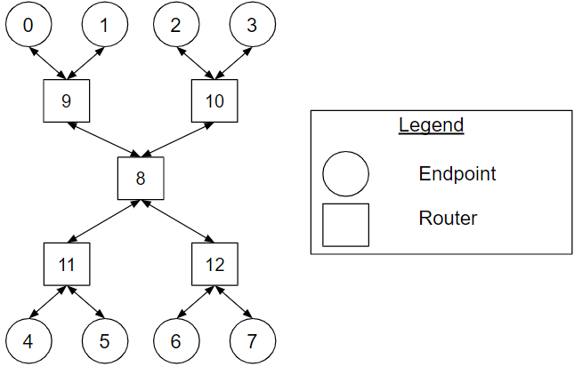
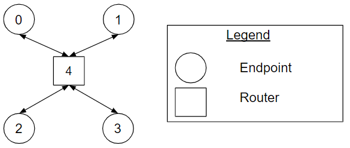
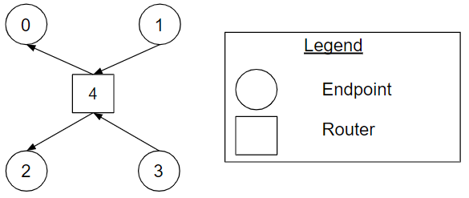

# Star Topology Types

## Overview

The star topology is a topology with a central router node.

## Hierarchical Star Topology 

The hierarchical star topology is a hierarchical topology with a central router
node that is only connected to router nodes, and the endpoint nodes are only
connected to leaf routers. It is identical to a
[bidirectional tree topology](./xls_noc_tree_topology.md#bidirectional_tree)
with the exception that there are no endpoints connected to the root router. The
channels are unidirectional or bidirectional. In practice, it is common that all
channels of the network be bidirectional.

**Figure Hierarchical_Star_example. A
hierarchical star topology example with eight endpoint nodes and five router
nodes.**

Figure [Hierarchical_Star_example](#hierarchical_star_example) shows a
hierarchical star topology example with eight endpoint nodes and five router
nodes. Router 8 is the central router that is only connected to router nodes 9,
10, 11 and 12. The endpoints [0, 1], [2, 3], [4, 5] and [6, 7] are connected to
leaf routers 9, 10, 11 and 12 respectively. All the channels of the network are
bidirectional.

## Star Topology 

The star topology is a topology with a single router: the central router node.
All communication flows through the central router (all traffic traverses
through the central router). The channels are bidirectional.

**Figure Star_example. A star topology example with
four endpoint nodes and the central router.**

Figure [Star_example](#star_example) shows a star topology example with four
endpoint nodes and the central router.

## Single Router Topology 

The single router topology is the star topology with the channels being
unidirectional. The single router topology has a single router: the central
router node. All communication flows through the central router (all traffic
traverses through the central router).

**Figure Single_Router_example. A single
router topology example with four endpoint nodes and the central router.**

Figure [Single_Router_example](#single_router_example) shows a single router
topology example with four endpoint nodes and the central router. Compared to
Figure Star_example, the channels are unidirectional.

## Cheat Sheet

*   The [hierarchical star](#hierarchical_star) topology is a hierarchical
    topology with a central router node that is only connected to router nodes,
    and the endpoint nodes are only connected to leaf routers.
*   The [star](#star) topology is a topology with a single router: the central
    router node. All traffic traverses through the central router. The channels
    are bidirectional.
*   The [single router](#single_router) topology is a topology with a single
    router: the central router node. All traffic traverses through the central
    router. The channels are unidirectional.
