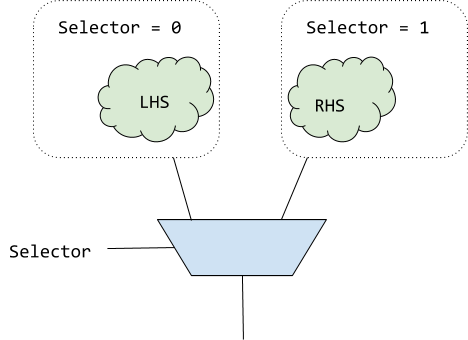
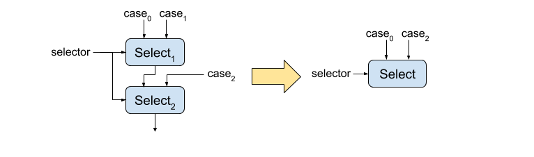

# XLS Optimizations

[TOC]

## Narrowing Optimizations

The XLS compiler performs **bitwise flow analysis**, and so can deduce that
certain bits in the output of operations are always-zero or always-one. As a
result, after running this bit-level tracking flow analysis, some of the bits on
the output of an operation may be "known". With known bits in the output of an
operation, we can often narrow the operation to only produce the *unknown* bits
(those bits that are not known static constants), which reduces the "cost" of
the operation (amount of delay through the operation) by reducing its bitwidth.

### Select operations

An example of this is select narrowing, as shown in the following -- beforehand
we have three operands, but from our bitwise analysis we know that there are two
constant bits in the MSb as well as two constant bits in the LSb being
propagated from all of our input operands.

{style="display:block;margin:auto;width:50%"}

Recognizing that property, we squeeze the one hot select operation -- in the
"after" diagram below observe we've narrowed the operation by slicing the
known-constant bits out of the one hot select operation, making it cheaper in
terms of delay, and propagated the slices up to the input operands -- these
slices being presented at the output of the operands may in turn let *them*
narrow their operation and become cheaper, and this can continue transitively):

{style="display:block;margin:auto;width:50%"}

### Arithmetic and shift operations

Most arithmetic ops support mixed bit widths where the operand widths may not be
the same width as each other or the result. This provides opportunities for
narrowing. Specfically (for multiplies, adds and subtracts):

1.  If the operands are wider than the result, the operand can be truncated to
    the result width.

1.  If the operation result is wider than the full-precision width of the
    operation, the operation result can be narrowed to the full-precision width
    then sign- or zero-extended (depending upon the sign of the operation) to
    the original width to produce the desired result. The full-precision width
    of an add or subtract is one more than the width of the widest operand, and
    the full-precision width of a multiply is the sum of the operand widths.

1.  If the most-significant bit of an operand are zeros (for unsigned
    operations) or the same as the sign-bit value (for signed operations), the
    operand can be narrowed to remove these known bits.

As a special case, adds can be narrowed if the least-significant bits of an is
all zeros. The add operation is narrowed to exclude this range of
least-significant bits. The least-signifant bits of the result are simply the
least-significant bits of the non-zero operand:


Similarly, if the most-significant bits of the shift-amount of a shift operation
are zero the shift amount can be narrowed.

### Comparison operations

Leading and trailing bits can be stripped from the operands of comparison
operations if these bits do not affect the result of the comparison. For
unsigned comparisons, leading and trailing bits which are identical between the
two operands can be stripped which narrows the comparison and reduces the cost
of the operation.

Signed comparison are more complicated to handle because the sign bit
(most-signicant bit) affects the interpretation of the value of the remaining
bits. Stripping leading bits must preserve the sign bit of the operand.

## Strength Reductions

### Arithmetic Comparison Strength Reductions

When arithmetic comparisons occur with respect to constant values, comparisons
which are be arithmetic in the general case may be strength reduced to more
boolean-analyzeable patterns; for example, comparison with mask constants:

```
u4:0bwxyz > u4:0b0011
```

Can be strength reduced -- for the left hand side to be greater one of the `wx`
bits must be set, so we can simply replace this with an or-reduction of `wx`.
Similarly, a trailing-bit and-reduce is possible for less-than comparisons.

NOTE These examples highlight a set of optimizations that are not applicable
(profitable) on traditional CPUs: the ability to use bit slice values below what
we'd traditionally think of as a fundamental comparison "instruction", which
would nominally take a single cycle.

## "Simple" Boolean Simplification

NOTE This optimization is a prelude to a more general optimization we expect to
come in the near future that is based on Binary Decision Diagrams. It is
documented largely as a historical note of an early / simple optimization
approach.

With the addition of the `one_hot_select` and its corresponding optimizations, a
larger amount of boolean logic appears in XLS' optimized graphs (e.g. or-ing
together bits in the selector to eliminate duplicate `one_hot_select` operands).
Un-simplified boolean operations compound their delay on the critical path; with
the process independent constant $\tau$ a single bit `or` might be $6\tau$,
which is just to say that having lots of dependent `or` operations can
meaningfully add up in the delay estimation for the critical path. If we can
simplify several layers of boolean operations into one operation (say, perhaps
with inputs optionally inverted) we could save a meaningful number of tau versus
a series of dependent boolean operations.

For a simple approach to boolean simplification:

*   The number of parameters to the boolean function is limited to three inputs
*   The truth table is computed for the aggregate boolean function by flowing
    input bit vectors through all the boolean operation nodes.
*   The result bit vectors on the output frontier are matched the resulting
    truth table from the flow against one of our standard operations (perhaps
    with the input operands inverted).

The algorithm starts by giving `x` and `y` their vectors (columns) from the
truth table, enumerating all possible bit combinations for those operands. For
example, consider two operands and a (bitwise) boolean function, the following
is the truth table:

```
X Y | X+~Y
----+------
0 0 |  1
0 1 |  0
1 0 |  1
1 1 |  1
```

Each column in this table is a representation of the possibilities for a node in
the graph to take on, as a vector. After giving the vector `[0, 0, 1, 1]` to the
first input node (which is arbitrarily called X) and the vector `[0, 1, 0, 1]`
to the second input node (which is arbitrarily called Y), and flowing those bit
vectors through a network of boolean operations, if you wind up with a vector
`[1, 0, 1, 1]` at the end, it is sound to replace that whole network with the
expression `X+~Y`. Similarly, if the algorithm arrived at the vector `[1, 1, 1,
1]` at the end of the network, you could replace the result with a literal `1`,
because it has been proven for all input operand possiblities the result is
always `1` in every bit. Effectively, this method works by brute force
enumerating all the possibilities for input bits and operating on all of those
possibilities at the same time. In the end, the algorithm arrives at a composite
boolean function that can be pattern matched against XLS's set of "simple
boolean functions".

In the following example there are two nodes on the "input frontier" for the
boolean operations (`sub` and `add`, which we "rename" to `x` and `y` for the
purposes of analysis).

{style="display:block;margin:auto;width:75%"}

As shown in the picture, the algorithm starts flowing the bit vector, which
represents all possible input values for `x` and `y`. You can see that the `not`
which produces $\bar{x}$ (marked with a red star) simply inverts all the entries
in the vector and corresponds to the $\bar{x}$ column in the truth table.
Similarly the `and` operation joins the two vector with the binary `&`
operation, and finally we end up with the blue-starred bit vector on the "output
frontier", feeding the dependent `one_hot_select` (marked as `ohs` in the
diagram).

When we resolve that final result bit vector with the blue star against our
table of known function substitutions, we see that the final result can be
replaced with a node that is simply `or(x, y)`, saving two unnecessary levels of
logic, and reducing the critical path delay in this example from something like
$13\tau$ to something like $6\tau$.

This basic procedure is then extended to permit three variables on the input
frontier to the boolean expression nodes, and the "known function" table is
extended to include all of our supported logical operators (i.e. `nand`, `nor`,
`xor`, `and`, `or`) with bit vectors for all combinations of inputs being
present, and when present, either asserted, or their inversions (e.g. we can
find $nand(\bar{X}, Y)$ even though X is inverted).

## Bit-slice optimizations

Bit-slice operations narrow values by selecting a contiguous subset of bits from
their operand. Bit-slices are zero-cost operations as no computation is
performed. However, optimization of bit-slices can be beneficial as bit-slices
can interfere with optimizations and hoisting bit-slices can narrow other
operations reducing their computation cost.

### Slicing sign-extended values

A bit-slice of a sign-extended value is a widening operation followed by a
narrowing operation and can be optimized. The details of the transformation
depends upon relative position of the slice and the sign bit of the original
value. Let `sssssssXXXXXXXX` be the sign-extended value where `s` is the sign
bit and `X` represents the bits of the original value. There are three possible
cases:

1.  Slice is entirely within the sign-extend operand.

    

    **Transformation:** replace the bit-slice of the sign-extended value with a
    bit-slice of the original value.

1.  Slice spans the sign bit of the sign-extend operand.

    

    **Transformation:** slice the most significant bits from the original value
    and sign-extend the result.

1.  Slice is entirely within the sign-extended bits.

    

    **Transformation:** slice the sign bit from the original value and
    sign-extend it.

To avoid introducing additional sign-extension operations cases (2) and (3)
should only be performed if the bit-slice is the only user of the
sign-extension.

## Concat optimizations

`Concat` (short for concatenation) operations join their operands into a single
word. Like `BitSlice`s, `Concat` operations have no cost since since they simply
create a new label to refer to a set of bits, performing no actual computation.
However, `Concat` optimizations can still provide benefit by reducing the number
of IR nodes (increases human readability) or by refactoring the IR in a way that
allows other optimizations to be applied. Several `Concat` optimizations involve
hoisting an operation on one or more `Cocnat`s to above the `Concat` such that
the operation is applied on the `Concat` operands directly. This may provide
opportunities for optimization by bringing operations which actually perform
logic closer to other operations performing logic.

### Hoisting a reverse above a concat

A `Reverse` operation reverses the order of the bits of the input operand. If a
`Concat` is reversed and the `Concat` has no other consumers except for
reduction operations (which are not sensitive to bit order), we hoist the
`Reverse` above the `Concat`. In the modified IR, the `Concat` input operands
are `Reverse`'d and then concatenated in reverse order, e.g. :

```
Reverse(Concat(a, b, c))
=> Concat(Reverse(c), Reverse(b), Reverse(a))
```

### Hoisting a bitwise operation above a concat

If the output of multiple `Concat` operations are combined with a bitwise
operation, the bitwise operation is hoisted above the `Concat`s. In the modified
IR, we have a single `Concat` whose operands are bitwise'd `BitSlice`s of the
original `Concat`s, e.g. :

```
Or(Concat(A, B), Concat(C, D)), where A,B,C, and D are 1-bit values
=> Concat(Or(Concat(A, B)[1], Concat(C, D)[1]), Or(Concat(A, B)[0], Concat(C, D)[0]))
```

In the case that an added `BitSlice` exactly aligns with an original `Concat`
operand, other optimizations (bit slice simplification, constant folding, dead
code elimination) will replace the `BitSlice` with the operand, e.g. for the
above example:

```
=> Concat(Or(A, C), Or(B, D))
```

### Merging consecutive bit-slices

If consecutive `Concat` operands are consecutive `BitSlice`s, we create a new,
merged `BitSlice` spanning the range of the consecutive `BitSlice`s. Then, we
create a new `Concat` that includes this `BitSlice` as an operand, e.g.

```
Concat(A[3:2], A[1:0], B)
=> Concat(A[3:0], B)
```

This optimization is sometimes helpful and sometimes harmful, e.g. in the case
that there are other consumers of the original `BitSlice`s, we may only end up
adding more IR nodes since the original `BitSlice`s will not be removed by DCE
once they are replaced in the `Concat`. Some adjustments might be able to help
with this issue. An initial attempt at this limited the application of this
optimization to cases where the given`Concat` is the only consumer of the
consecutive `BitSlice`s. This limited the more harmful applications of this
optimization, but also reduced instances in which the optimization was
beneficially applied (e.g. the same consecutive `BitSlice`s could be merged in
multiple `Concat`s).

## Select optimizations

XLS supports two types of select operations:

1.  `Select` (opcode `Op::kSel`) is a traditional multiplexer. An `n`-bit
    binary-encoded selector chooses among 2**`n` inputs.

1.  `OneHotSelect` (opcode `Op::kOneHotSel`) has one bit in the selector for
    each input. The output of the operation is equal to the logical-or reduction
    of the inputs corresponding to the set bits of the selector. Generally, a
    `OneHotSelect` is lower latency and area than a `Select` as a `Select` is
    effectively a decode operation followed by a `OneHotSelect`.

### Converting chains of `Select`s to into a single `OneHotSelect`

A linear chain of binary `Select` operations may be produced by the front end to
select amongst a number of different values. This is equivalent to nested
ternary operators in C++.


A chain of `Select`s has high latency, but latency may be reduced by converting
the `Select` chain into a single `OneHotSelect`. This may only be performed if
the single-bit selectors of the `Select` instructions are one-hot (at most one
selector is set at one time). In this case, the single-bit `Select` selectors
are concatenated together to produce the selector for the one hot.


This effectively turns a serial operation into a lower latency parallel one. If
the selectors of the original `Select` instructions can be all zero (but still
at most one selector is asserted) the transformation is slightly modified. An
additional selector which is the logical NOR of all of the original `Select`
selector bits is appended to the `OneHotSelect` selector and the respective case
is the value selected when all selector bits are zero (`case_0` in the diagram).

### Specializing select arms

Within any given arm of a `Select` multiplexer, we can assume that the
selector has the specific value required to select that arm. This assumption
is safe because in the event that the selector has a different value, the
arm is dead.



This makes it possible to try specialize the arms based on the selector
value. In the above example, a LHS of `Selector + x` could be simplified to
`0 + x`.

The current optimization simply substitutes any usages of the selector in a
`Select` arm with its known value in that arm. Future improvements could use
range based analysis or other techniques to narrow down the possible values of
any variables within the selector, and use that information to optimize the
select arms.

## Consecutive selects with identical selectors

Two consecutive two-way selects which use the same selector can be compacted
into a single select statement. The selector only has two states so only two of
the three different cases may be selected. The third is dead. Visually, the
transformation looks like:



The specific cases which remain in the new select instruction depends on whether
the upper select feeds the true or false input of the lower select.

## Binary Decision Diagram based optimizations

A binary decision diagram (BDD) is a data structure that can represent arbitrary
boolean expressions. Properties of the BDD enable easy determination of
relationships between different expressions (equality, implication, etc.) which
makes them useful for optimization and analysis

### BDD common subexpression elimination

Determining whether two expression are equivalent is trivial using BDDs. This
can be used to identify operations in the graph which produce identical results.
BDD CSE is an optimization pass which commons these equivalent operations.

### OneHot MSB elimination

A `OneHot` instruction returns a bitmask with exactly one bit equal to 1. If the
input is not all-0 bits, this is the first 1 bit encountered in the input going
from least to most significant bit or vice-versa depending on the priority
specified. If the input is all-0 bits, the most significant bit of the `OneHot`
output is set to 1. The semantics of `OneHot` are described in detail
[here](./ir_semantics.md). If the MSB of a `OneHot`
does not affect the functionality of a program, we replace the MSB with a 0-bit,
e.g.

```
OneHot(A) such that the MSB has no effect
⇒ Concat(0, OneHot(A)[all bits except MSB]))
```

This can open up opportunities for further optimization. To determine if a
`OneHot`’s MSB has any effect on a function, we iterate over the `OneHot`’s
post-dominators. We use the BDD to test if setting the `OneHot`’s MSB to 0 or to
1 (other bits are 0 in both cases) implies the same value for the post-dominator
node. If so, we know the value of the MSB cannot possibly affect the function
output, so the MSB can safely be replaced with a 0 bit. Note: This approach
assumes that IR nodes do not have any side effects. When IR nodes with side
effects are introduced (i.e. channels) the analysis for this optimization will
have to be adjusted slightly to account for this.

## Traditional compiler optimizations

Many optimizations from traditional compilers targeting CPUs also apply to the
optimization of hardware. Common objectives of traditional compiler
optimizations include exposing parallelism, reducing latency, and eliminating
instructions. Often these translate directly into the primary objectives of
hardware optimization of reducing delay and area.

### Common Subexpression Elimination (CSE)

TODO: Finish.

### Constant Folding

TODO: Finish.

### Dead Code Elimination (DCE)

TODO: Finish.

### Reassociation

Reassociation in XLS uses the associative and commutative property of arithmetic
operations (such as adds and multiplies) to rearrange expressions of identical
operations to minimize delay and area. Delay is reduced by transforming chains
of operations into balanced trees which reduces the critical-path delay. For
example, given the following expression:


This can be reassociated into the following balanced tree:


The transformation has reduced the critical path through the expression from
three adds down to two adds.

Reassociation can also create opportunities for constant folding. If an
expression contains multiple literal values (constants) the expressions can be
reassociated to gather literals into the same subepxression which can then be
folded. Generally this requires the operation to be commutative as well as
associative. For example, given the following expression:


This can be reassociated into:


The right-most add of the two literals can be folded reducing the number of adds
in the expression to two.
