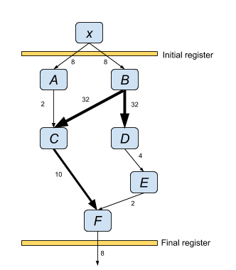
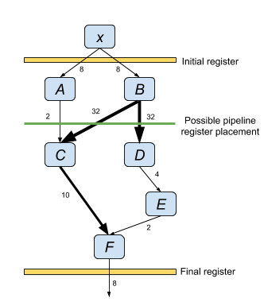

# XLS Pipeline scheduling

[TOC]

Pipeline scheduling divides the IR nodes of an XLS function or proc into a
sequence of stages constituting a feed-forward pipeline. Sequential stages are
separated by registers enabling pipeline parallelism. The schedule must satisfy
dependency constraints between XLS nodes as well as timing constraints imposed
by the target clock frequency. Pipeline scheduling has multiple competing
optimization objectives: minimize number of stages (minimize pipeline latency),
minimize maximum delay of any stage (maximize clock frequency), and minimize the
number of pipeline registers.

## Scheduling process

Pipeline scheduling occurs in two phases:

1.  Determine the effective clock period. This clock period defines the maximum
    delay, based on XLS's internal [delay model](delay_estimation.md), through
    any pipeline stage and limits how many IR operations might be placed in each
    stage.

2.  Given the constraints of the effective clock period and, optionally, a
    user-defined number of pipeline stages, find the schedule which minimizes
    the number of pipeline registers. Pipeline registers are required for any IR
    operation whose value which is used in a later stage.

The schedule process is controlled via several options defined
[here](https://github.com/google/xls/tree/main/xls/scheduling/tools/pipeline_schedule.h).
These options are typically passed in as flags to the
[`codegen_main` binary](https://github.com/google/xls/tree/main/xls/tools/codegen_main.cc)
but maybe set programmatically. Each is optional though at least one of **clock
period** or **pipeline stages** must be specified. Different combinations of
options result in different strategies as described [below](#common-options).

Clock period
:   The target clock period.

Pipeline stages
:   The number of stages in the pipeline.

Clock margin percent
:   The percentage to reduce the target clock period before scheduling. May only
    be specified with **clock period**. This option is equivalent to specifying
    a reduced value for **clock period**.

Clock period relaxation percent:
:   This is the percentage that the computed minimum clock period, as determined
    by the number of pipeline stages, is increased (relaxed) prior to
    scheduling. May not be specified with **clock period**.

### Step 1: determine the effective clock period

The effective clock period determines the maximum delay through any pipeline
stage for the purpose of scheduling. The value is determined in one of two ways
depending upon whether the **clock period** option is specified.

1.  **clock period** specified

    The effective clock period is set the **clock period** value. If **clock
    margin percent** is also specified, then the effective clock period is also
    reduced by the given percentage. Example: if **clock period** is 800ps and
    **clock margin percent** is 20% then the effective clock period is 640ps.

2.  **clock period** not specified

    In this case, **pipeline stages** must be specified. The effective clock
    period is computed as the minimum clock period in which a schedule may be
    found that meets timing with the specified number of pipeline stages. This
    is done via a binary search through clock period values. If **clock period
    relaxation percent** is specified then the computed effective clock period
    is *increased* by the given percentage. The motivation is that this
    relaxation may result in fewer pipeline registers because of increased
    scheduling flexibility. Example: if the minimum clock period found by XLS
    was 1000ps and **clock period relaxation percent** is 10% the effective
    clock period is 1100ps.

### Step 2: schedule to minimize pipeline registers

Once an effective clock period is determined, XLS computes a schedule which
minimizes the number of registers (see [below](#min-cut) for details) while
satisfying the critical path delay constraints imposed by the effective clock
period. The number of stages in the pipeline may be specified by the user via
the **pipeline stages** option. If the number of pipeline stages specified is
too small an error such that no feasible schedule can be found then an error is
returned. If **pipeline stages** is not given then the minimum number of stages
which meets the delay constraint imposed by the effective clock period is used.

### Options for common scheduling objectives {#common-options}

Different scheduling options result in different optimization strategies for the
scheduler. Below are several common scheduling objectives and options which
should be set to enable them.

1.  Minimize the number of pipeline registers for a given clock period and given
    number of pipeline stages.

    Specify both **clock period** and **pipeline stages**. The scheduler will
    attempt to minimize the number of pipeline registers given those
    constraints. The option **clock margin percent** can be swept to search the
    local design space (or equivalently, sweep **clock period**)

2.  Minimize the clock period for a given number of pipeline stages

    Specify only **pipeline stages**. XLS will find a schedule with minimum
    clock period with a secondary objective of minimizing the number of pipeline
    registers. Sweeping **clock period relaxation percent** explores relaxing
    the timing constraint which may result in fewer pipeline registers.

3.  Minimize the number of pipeline stages for a given clock period

    Specify only **clock period**. XLS will find a schedule of the minimum
    number of stages with a secondary objective of minimizing the number of
    pipeline registers. The option **clock margin percent** can be swept to
    search the local design space (or equivalently, sweep **clock period**)

4.  Minimize the number of pipeline registers for a given clock period

    Specify only **clock period** and sweep **pipeline stages**. Pick the
    schedule which produces the minimum number of pipeline registers.

5.  Sweep the entire scheduling space

    The various options directly or indirectly control the two degrees of
    freedom within the scheduler: pipeline stages and clock period. Sweeping
    these two degrees of freedom is most easily done by sweeping **pipeline
    stages** and **clock period relaxation percent**. The advantage of sweeping
    **clock period relaxation percent** instead of **clock period** directly is
    that the percent relaxation can be a fixed range (e.g., 0 to 50%) for all
    designs and each value will produce a feasible schedule. If **clock period**
    is swept some combinations of **pipeline stages* and **clock period** values
    will result in an error returned because the design point is infeasible.

## Minimizing pipeline registers via min-cut {#min-cut}

Scheduling to minimize pipeline registers can be formulated as a graph min-cut
problem where the graph cut divides the nodes of the graph into separate
pipeline stages and the cost of the cut is the number of bits in the pipeline
register between the stages. This formulation of the pipeline scheduling problem
is attractive because the graph min-cut problem can be solved in polynomial
time.

In general, the XLS IR graph cannot be used directly by the min-cut algorithm
because of additional constraints imposed by pipeline scheduling and features of
the IR graph. As a motivating example, consider the following graph of an XLS
function to be scheduled into a two-stage pipeline:

Node ***x*** is a parameter to the function, and node ***F*** is the return
value. The width of the edges correlates with the (labeled) bit width of the
respective operation. The bit width of the edges are edge weights in the min-cut
algorithm.

The drawing above shows the initial and final pipeline registers which flops the
input output on the interface boundary. In this example, a two-stage pipeline is
desired so one additional pipeline register is required. The scheduling problem
is to partition the nodes ***A*** through ***F*** into the two pipeline stages
while minimizing register count, or alternatively formulated, identify a cut
through the graph of minimum cost. Below is one possible cut resulting in a
pipeline schedule where nodes ***A*** and ***B*** are in stage one and nodes
***C*** through ***F*** are in stage two.

In the pipeline generated from the example cut above pipeline registers are
required for nodes ***A*** and ***B*** of bit widths 2 and 32 respectively for a
total of 34 flops. However this value is inconsistent with the cost of the cut
in the IR graph which is equal to the sum of weights of the cut edges: 2 + 32 +
32 = 66. To reconcile the cost function, transformations are applied to the
graph about nodes with fan-out. Specifically, an artificial node ***N'*** is
added for each node ***N*** with fan-out and an edge is added from each
immediate successor of ***N*** to ***N'***. The weight of each edge fanning out
from ***N*** and fanning into ***N'*** is set to the original weight of the
edges of ***N*** divided by the fan-out factor. In the example, the edge weight
is set to 32 / 2 = 16. Below is the transformed graph. As shown, the cost of the
cut (sum of edge weights) now equals the number of flops in the pipeline
register (34).

For scheduling the example graph, assume the target clock period be three time
units and all nodes have unit delay. In this case, not all cuts will produce a
schedule which satisfies the timing constraint. Specifically, if ***B*** is
scheduled in the second stage, or ***F*** is scheduled in the first stage the
pipeline cannot meet the timing constraint. To ensure the min-cut results in a
schedule which satisfies timing an artificial source and sink node is added to
the graph. Edges with infinite weight are added from the source to nodes which
must be scheduled in the first stage (or earlier in the case of parameter nodes)
to satisfy timing constraints. Similar edges are added from nodes which must be
scheduled in the second stage to the sink node as shown below:

One additional transformation (not shown) is required to ensure a correct
pipeline. Generally, a partitioning created by a min-cut allows edges going in
both directions between the partitions. However, pipeline stages do not allow
circular dependencies. To enforce directionality to the edges of the cut, an
edge of infinite weight is added parallel to and in the opposite direction of
every edge in the graph.

After transforming the graph, a min-cut is found by applying a max flow
algorithm (Ford-Fulkerson) from the artificial source node to the artificial
sink node. In the running example, the min cut is edges ***C*** -> ***F*** and
***E*** -> ***F*** of cost 12. All nodes except ***F*** are placed in the first
stage of the pipeline.

Generally, a pipeline can have more than two stages so a single cut is
insufficient to determine a schedule. In this case a sequence of cuts is
performed, one for each boundary between pipeline stages. Each min-cut
partitions the nodes into two parts: the set of nodes scheduled before the
respective stage boundary, and the set of node scheduled after. This imposes
additional constraints on later min-cut computations. These constraints are
imposed by extending infinite weight edges between these nodes and the source or
sink node in the graph.

The order in which the sequence of cuts is performed (e.g., cut the boundary
between stage 0 and stage 1, then between 1 and 2, then between 2 and 3, and so
on) can affect the total number of pipeline flops so, in general, multiple
orders are attempted and the result with the fewest pipeline flops is kept.

## Rematerialization

TODO(meheff): Finish.
