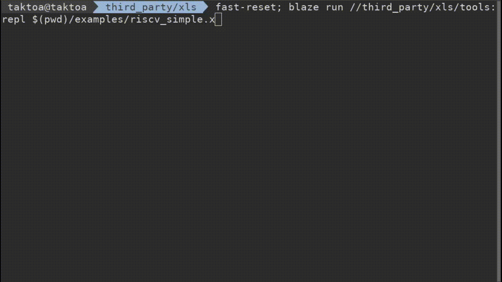

# XLS Tools

An index of XLS developer tools.

## [`bdd_stats`](https://github.com/google/xls/tree/main/xls/tools/bdd_stats.cc)

Constructs a binary decision diagram (BDD) using a given XLS function and prints
various statistics about the BDD. BDD construction can be very slow in
pathological cases and this utility is useful for identifying the underlying
causes. Accepts arbitrary IR as input or a benchmark specified by name.

## [`benchmark_main`](https://github.com/google/xls/tree/main/xls/dev_tools/benchmark_main.cc)

Prints numerous metrics and other information about an XLS IR file including:
total delay, critical path, codegen information, optimization time, etc. This
tool may be run against arbitrary IR not just the fixed set of XLS benchmarks.
The output of this tool is scraped by `run_benchmarks` to construct a table
comparing metrics against a mint CL across the benchmark suite.

## [`booleanify_main`](https://github.com/google/xls/tree/main/xls/dev_tools/booleanify_main.cc)

Rewrites an XLS IR function in terms of its ops' fundamental AND/OR/NOT
constituents, i.e., makes all operations boolean, thus it's "booleanifying" the
function.

## [`codegen_main`](https://github.com/google/xls/tree/main/xls/tools/codegen_main.cc)

Lowers an XLS IR file into Verilog. Options include emitting a feedforward
pipeline or a purely combinational block. Emits both a Verilog file and a module
signature which includes metadata about the block. The tool does not run any XLS
passes so unoptimized IR may fail if the IR contains constructs not expected by
the backend.

For a detailed list of codegen options including I/O configurations, please
visit the [codegen options](codegen_options.md) page.

## [`delay_info_main`](https://github.com/google/xls/tree/main/xls/tools/delay_info_main.cc)

Dumps delay information about an XLS function including per-node delay
information and critical-path.

## [`eval_ir_main`](https://github.com/google/xls/tree/main/xls/tools/eval_ir_main.cc)

Evaluates an XLS IR file with user-specified or random inputs. Includes features
for evaluating the IR before and after optimizations which makes this tool very
useful for identifying optimization bugs.

This tool accepts two [mutually exclusive] optional args,
`--input_validator_expr` and `--input_validator_path`, which allow the user to
specify an expression to "filter" potential input values to discard invalid
ones. For both, the filter must be a function, named `validator`, and must take
params of the same layout as the function under test. This function should
return true if the inputs are valid for the function and false otherwise.
`--input_validator_expr` lists the function as an inline command-line argument,
whereas `--input_validator_path` holds the path to a .x file containing the
validation function.

## Jit Inspection {#jit-inspect}

One can use the `jit:dump_llvm_artifacts` tool to inspect the jit code produced
by our function and proc jit.

One simply provides a directory to place the resulting artifacts and an ir file.

```sh
$ bazel run xls/jit:dump_llvm_artifacts -- --out_dir=/tmp/muladd --ir=/tmp/muladd.ir
Generating XLS artifacts
Can't generate a test-main without an input & result
$ ls /tmp/muladd
result.asm             result.entrypoints.txtpb  result.o
result.entrypoints.pb  result.ll                 result.opt.ll
```

This generates a number of files.

-   `result.ll`: The unoptimized llvm ir that our JIT/aot produces
-   `result.opt.ll`: The optimized llvm ir that our JIT/aot actually compiles.
-   `result.asm`: Result of compiling the `result.opt.ll` as assembly
-   `result.o`: Result of compiling the `result.opt.ll` as object code
-   `result.entrypoints.{txt,}pb`: The AotPackageEntrypointsProto describing the
    compiled code in both text and binary format.

Note: LLVM can change significantly and bytecode is not always compatible
between versions. If possible, LLVM tools built at the same commit as the JIT
should be used to interact with the generated llvm bytecode. This can be done by
building the LLVM tools using `bazel build` from the XLS repo.

## [`ir_minimizer_main`](https://github.com/google/xls/tree/main/xls/dev_tools/ir_minimizer_main.cc)

Tool for reducing IR to a minimal test case based on an external test.

## [`ir_stats_main`](https://github.com/google/xls/tree/main/xls/tools/ir_stats_main.cc)

Prints summary information/stats on an IR [Package] file. An example:

```
$ bazel-bin/xls/tools/ir_stats_main bazel-genfiles/xls/modules/fp32_add_2.ir
Package "fp32_add_2"
  Function: "__float32__is_inf"
    Signature: ((bits[1], bits[8], bits[23])) -> bits[1]
    Nodes: 8

  Function: "__float32__is_nan"
    Signature: ((bits[1], bits[8], bits[23])) -> bits[1]
    Nodes: 8

  Function: "__fp32_add_2__fp32_add_2"
    Signature: ((bits[1], bits[8], bits[23]), (bits[1], bits[8], bits[23])) -> (bits[1], bits[8], bits[23])
    Nodes: 252
```

## [`check_ir_equivalence`](https://github.com/google/xls/tree/main/xls/dev_tools/check_ir_equivalence_main.cc)

Verifies that two IR files (for example, optimized and unoptimized IR from the
same source) are logically equivalent.

## [`opt_main`](https://github.com/google/xls/tree/main/xls/tools/opt_main.cc)

Runs XLS IR through the optimization pipeline.

Standard flags include:

*   `--top=NAME`: Override/set the top function/proc. This is required if a
    function/proc is not already marked as `top` in the IR.
*   `--opt_level=NUMBER`: Change the optimization level. This should be used
    with care as the differences between optimization levels are less defined
    for xls than they are in tools such as `clang`. Defaults to `3`.

Several flags which control the behavior of individual optimizations are also
available. Care should be used when modifying the values of these flags.

*   `--rm_rewrites_pb=FILE`: Used to pass a proto describing the ram rewrites to
    be performed.
*   `--inline_procs=true|false`: Whether to enable or disable inlining all procs
    into a single mega-proc. Defaults to `false`.
*   `--convert_array_index_to_select=NUMBER`: Controls the maximum number of
    dimensions an array can have to allow xls to convert accesses to the array
    into select chains. This can have complicated impacts on the area and delay
    of the generated code.
*   `--use_context_narrowing_analysis=true|false`: Controls whether to use
    contextual information to optimize range calculations. This can in some
    circumstances reveal additional optimization opportunities but it can be
    quite slow. Defaults to `false`.

### Debugging/Experimenting with Optimizations

There are also several flags which are used for debugging and understanding the
behavior of the standard optimization pipeline itself and the passes which make
up the pipeline. These flags should mostly be used for testing and debugging
purposes only.

*   `--passes=PIPELINE_SPEC`: Allows one to specify an explicit optimization
    pipeline to use instead of the standard one. The pipeline is specified by
    listing passes using their short-names. Different passes are space
    separated. Fixed-point combinations of passes are specified by surrounding
    them with square-brackets '`[]`'. For example, to run the pipeline
    'inlining' then 'arith_simp' and 'dce' to fixed-point then 'narrowing' and a
    final 'dce' the flag would be set to `inlining [ arith_simp dce ] narrowing
    dce`. This can be used to test odd interactions between specific or single
    passes.
*   `--passes_bisect_limit=NUMBER`: Tells `opt_main` to cease pipeline execution
    after running `NUMBER` passes. This can be used to narrow down misbehaving
    passes. This flag works with both custom `--passes` pipelines and the
    standard pipeline.
*   `--ir_dump_path=FOLDER`: Tells `opt_main` to dump files containing all the
    intermediate states of the optimizations IRs into files in that particular
    directory. Each file is named so they sort lexicographically in the order
    they were created. The names include the pass-number, the pass run and
    whether the pass made any changes to the output.
*   `--skip_passes=NAME1,NAME2,...`: Tells `opt_main` to skip execution of
    specific named passes (specified using the short-name of the pass). This
    does not otherwise modify the pipeline being used and the pass is considered
    to have finished successfully without making any changes. Multiple passes
    may be passed at once separated by commas.

## [`print_bom`](https://github.com/google/xls/tree/main/xls/tools/print_bom.cc)

Tool to calculate and print a summary of the BOM (bill of materials) elements
from `ModuleSignatureProto` protobuf files produced using the
`--output_signature_path` codegen argument.

Features include;

*   Combining the data from multiple protobuf files.
*   Output in fancy human readable table.
*   Output machine readable CSV (common separate values) file for loading into
    other tools (like Google Sheets).
*   Filtering output to a single value type like `BOM_KIND_ADDER`.

Running the following commands;

```
bazel build //xls/examples/protobuf:varint_encode_sv
bazel run //xls/tools:print_bom -- --root_path $PWD/bazel-bin/xls/examples/protobuf/
```

should produce the following output;

```
Found 1 protobuf files.
 * "bazel-bin/xls/examples/protobuf/varint_encode_u32.sig.textproto"

 +------------------------+----------------+-------------+--------------+-------+
 |                   Kind |             Op | Input Width | Output Width | Count |
 +------------------------+----------------+-------------+--------------+-------+
 |    BOM_KIND_COMPARISON |             ne |           4 |            1 |     1 |
 |                        |                |           7 |            1 |     2 |
 |                        |                |          11 |            1 |     1 |
 |                        |                |          18 |            1 |     1 |
 |                        |                |          25 |            1 |     1 |
 +------------------------+----------------+-------------+--------------+-------+
 | BOM_KIND_INSIGNIFICANT |          array |           8 |           40 |     1 |
 |                        |      bit_slice |          32 |            4 |     1 |
 |                        |                |          32 |            7 |     4 |
 |                        |                |          32 |           11 |     1 |
 |                        |                |          32 |           18 |     1 |
 |                        |                |          32 |           25 |     1 |
 |                        |         concat |           1 |            2 |     1 |
 |                        |                |           2 |            3 |     1 |
 |                        |                |           4 |            8 |     1 |
 |                        |                |           7 |            8 |     4 |
 |                        |        literal |           0 |            1 |     2 |
 |                        |                |           0 |            2 |     2 |
 |                        |                |           0 |            3 |     2 |
 |                        |                |           0 |            4 |     2 |
 |                        |                |           0 |            7 |     2 |
 |                        |                |           0 |           11 |     1 |
 |                        |                |           0 |           18 |     1 |
 |                        |                |           0 |           25 |     1 |
 |                        |          tuple |          40 |           43 |     1 |
 +------------------------+----------------+-------------+--------------+-------+
 |          BOM_KIND_MISC |     input_port |           0 |           32 |     1 |
 |                        |    output_port |          43 |            0 |     1 |
 |                        |  register_read |           0 |           32 |     1 |
 |                        |                |           0 |           43 |     1 |
 |                        | register_write |          32 |            0 |     1 |
 |                        |                |          43 |            0 |     1 |
 +------------------------+----------------+-------------+--------------+-------+
 |        BOM_KIND_SELECT |            sel |           2 |            2 |     2 |
 |                        |                |           3 |            3 |     2 |
 +------------------------+----------------+-------------+--------------+-------+
```

To save the details about the comparison operators to a machine readable CSV
file you can do;

```
bazel run //xls/tools:print_bom -- --root_path=$PWD/bazel-bin/xls/examples/protobuf/ --output_as=csv --op_kind=BOM_KIND_COMPARISON > my.csv
```

which will produce a CSV file which looks like the following;

```csv
Kind,Op,Input Width,Output Width,Count
BOM_KIND_COMPARISON,ne,4,1,1
BOM_KIND_COMPARISON,ne,7,1,2
BOM_KIND_COMPARISON,ne,11,1,1
BOM_KIND_COMPARISON,ne,18,1,1
BOM_KIND_COMPARISON,ne,25,1,1
```

## [`dslx/interpreter_main`](https://github.com/google/xls/tree/main/xls/dslx/interpreter_main.cc)

Interpreter for DSLX code and test-runner.

The `--compare` flag allows to also cross-checks that the conversion to IR and
JIT compilation of the IR produces the same values.

```
$ bazel run -c opt //xls/dslx:interpreter_main -- $PWD/xls/dslx/stdlib/std.x
[ RUN UNITTEST  ] sizeof_signed_test
[            OK ]
...
```

Note that this binary takes a command line argument `--dslx_path` which
indicates where the binary should search for `.x` files on import (i.e. an
import resolution path). Try to use this sparingly, but it is useful for
pointing at installation locations where DSLX modules have been placed.

In a Bazel environment this binary is encapsulated in
[an `xls_dslx_test` target](https://google.github.io/xls/bazel_rules_macros/#xls_dslx_test)

## [`dslx/prove_quickcheck_main`](https://github.com/google/xls/tree/main/xls/dslx/prove_quickcheck_main.cc)

Command line utility for attempting to prove a quickcheck property via SMT
translation. Invoke this tool as:

`prove_quickcheck_main $ENTRY_FILE $QUICKCHECK_NAME`

And it will attempt to prove the given quickcheck property over the entire input
domain. Example:

```
$ bazel run -c opt //xls/dslx:prove_quickcheck_main -- $PWD/xls/dslx/stdlib/std.x convert_to_from_bools
Proven! elapsed: 115.419669ms
```

!!! NOTE
    Currently an error code is returned if it cannot be proven, but it does
    not dump a counterexample to terminal. A temporary workaround is to use
    `--alsologtostderr --v=1` until that functionality is completed.

## [`dslx/dslx_fmt`](https://github.com/google/xls/tree/main/xls/dslx/dslx_fmt.cc)

Auto-formatter for DSLX code (i.e. `.x` files). This is analogous to rustfmt /
clang-format.

To format a file in-place, use the `-i` flag:

```
$ bazel build -c opt //xls/dslx:dslx_fmt
$ echo 'fn f(x:u32)->u32{x}' > /tmp/my_file.x
$ ./bazel-bin/xls/dslx/dslx_fmt -i /tmp/my_file.x
$ cat /tmp/my_file.x
fn f(x: u32) -> u32 { x }
```

Without the `-i` flag the formatted result is given in the standard output from
the tool and the input file path remains unchanged.

**Note:** there is also a Bazel build construct to ensure files remain
auto-formatted using the latest `dslx_fmt` results:

```
load("//xls/build_rules:xls_build_defs.bzl", "xls_dslx_fmt_test")

xls_dslx_fmt_test(
    name = "my_file_dslx_fmt_test",
    src = "my_file.x",
)
```

Also see the
[Bazel rule documentation for `xls_dslx_fmt_test`](https://google.github.io/xls/bazel_rules_macros/#xls_dslx_fmt_test).

## [`dslx/ir_convert/ir_converter_main`](https://github.com/google/xls/tree/main/xls/dslx/ir_convert/ir_converter_main.cc)

Tool for converting DSLX code (i.e. whole `.x` files or functions/procs inside
of `.x` files) into XLS IR.

```
$ bazel build -c opt //xls/dslx/ir_convert:ir_converter_main
$ echo 'fn f(x:u32)->u32{x}' > /tmp/my_file.x
$ ./bazel-bin/xls/dslx/ir_convert/ir_converter_main /tmp/my_file.x > /tmp/my_file.ir
$ cat /tmp/my_file.ir
package my_file

file_number 0 "/tmp/my_file.x"

fn __my_file__f(x: bits[32]) -> bits[32] {
  ret x: bits[32] = param(name=x)
}
```

## [`proto_to_dslx_main`](https://github.com/google/xls/tree/main/xls/tools/proto_to_dslx_main.cc)

Takes in a proto schema and a textproto instance thereof and outputs a DSLX
module containing a DSLX type and constant matching both inputs, respectively.

Not all protocol buffer types map to DSLX types, so there are some restrictions
or other behaviors requiring explanation:

1.  Only scalar and repeated fields are supported (i.e., no maps or oneofs,
    etc.).
1.  Only recursively-integral messages are supported, that is to say, a message
    may contain submessages, as long as all non-Message fields are integral.
1.  Since DSLX doesn't support variable arrays and Protocol Buffers don't
    support fixed-length repeated fields. To unify this, all instances of
    repeated-field-containing Messages must have the same size of their repeated
    members (declared as arrays in DSLX). This size will be calculated as the
    maximum size of any instance of that repeated field across all instances in
    the input textproto. For example, if a message `Foo` has a repeated field
    `bar`, and this message is present multiple times in the input textproto,
    say as:

    ```
      foo: {
        bar: 1
      }
      foo: {
        bar: 1
        bar: 2
      }
      foo: {
        bar: 1
        bar: 2
        bar: 3
      }
    ```

    the DSLX version of `Foo` will declare `bar` has a 3-element array. An
    accessory field, `bar_count`, will also be created, which will contain the
    number of valid entries in an actual instance of `Foo::bar`.

    The "Fields" example in
    `./xls/tools/testdata/proto_to_dslx_main.*` demonstrates this
    behavior.

## [`repl`](https://github.com/google/xls/tree/main/xls/tools/repl.cc)

Allows you to interactively run various parts of the compiler, including
parsing/type checking (`:reload`), lowering/optimization (`:ir`), Verilog
codegen (`:verilog [identifier]`), and LLVM codegen (`:llvm`, not yet
implemented). You can also inspect the IR types of identifiers with `:type`, and
even imported identifiers can be accessed with `:type foo::bar`.



## [`simulate_module_main`](https://github.com/google/xls/tree/main/xls/tools/simulate_module_main.cc)

Runs a Verilog block emitted by XLS through a Verilog simulator. Requires both
the Verilog text and the module signature which includes metadata about the
block.

## [`smtlib_emitter_main`](https://github.com/google/xls/tree/main/xls/tools/smtlib_emitter_main.cc)

Simple driver for Z3IrTranslator - converts a given IR function into its Z3
representation and outputs that translation as SMTLIB2.

First obtain an XLS IR file:

```
$ bazel build -c opt //xls/examples:tiny_adder.opt.ir
```

And then feed that XLS IR file into this binary:

```
$ bazel run -c opt //xls/tools:smtlib_emitter_main -- --ir_path \
    $PWD/bazel-bin/xls/examples/tiny_adder.opt.ir
(bvadd (concat #b0 x) (concat #b0 y))
```

To turn it into "gate level" SMTLib, we can do a pre-pass through the
`booleanify_main` tool:

```
$ bazel run -c opt //xls/tools:booleanify_main -- --ir_path \
   $PWD/bazel-bin/xls/examples/tiny_adder.opt.ir \
   > /tmp/tiny_adder.boolified.ir
$ bazel run -c opt //xls/tools:smtlib_emitter_main -- \
    --ir_path /tmp/tiny_adder.boolified.ir
(let ((a!1 (bvand (bvor ((_ extract 0 0) x) ((_ extract 0 0) y))
                  (bvnot (bvand ((_ extract 0 0) x) ((_ extract 0 0) y))))))
(let ((a!2 (bvor (bvand (bvor #b0 #b0) (bvnot (bvand #b0 #b0)))
                 (bvor (bvand ((_ extract 0 0) x) ((_ extract 0 0) y))
                       (bvand a!1 #b0))))
      (a!3 (bvand (bvand (bvor #b0 #b0) (bvnot (bvand #b0 #b0)))
                  (bvor (bvand ((_ extract 0 0) x) ((_ extract 0 0) y))
                        (bvand a!1 #b0)))))
  (concat (bvand a!2 (bvnot a!3))
          (bvand (bvor a!1 #b0) (bvnot (bvand a!1 #b0))))))
```

## [`solver`](https://github.com/google/xls/tree/main/xls/tools/solver.cc)

Uses a SMT solver (i.e. Z3) to prove properties of an XLS IR program from the
command line. Currently the set of "predicates" that the solver supports from
the command line are limited, but in theory it is capable of solving for
arbitrary IR-function-specified predicates.

This can be used to uncover opportunities for optimization that were missed, or
to prove equivalence of transformed representations with their original version.

## [`cell_library_extract_formula`](https://github.com/google/xls/tree/main/xls/tools/cell_library_extract_formula.cc)

Parses a cell library ".lib" file and extracts boolean formulas from it that
determine the functionality of cells. This is useful for LEC of the XLS IR
against the post-synthesis netlist.

## [`dslx/highlight_main`](https://github.com/google/xls/tree/main/xls/dslx/highlight_main.cc)

Performs terminal-based color code highlighting of a DSL file.

## [`dslx/type_system/typecheck_main`](https://github.com/google/xls/tree/main/xls/dslx/type_system/typecheck_main.cc)

Dumps type information that has been deduced for a given DSL file.

## Development Tools

### clang-tidy

For C++ development, you might need a compilation database to have good support
in your IDE. You can create the `compile_commands.json` by running this script.

```
xls/dev_tools/make-compilation-db.sh
```

To run clang-tidy and create a report of things that might be worthwhile fixing,
use the following script:

```
xls/dev_tools/run-clang-tidy-cached.sh
```

(Note, this will be pretty slow on the first run, but it caches results and will
only reprocess changed files in subsequent runs).

The output of the clang-tidy runs shows up in the `xls_clang-tidy.out` file
which is formatted just like an output from a compiler. So to quickly work with
these, you can use `cat xls_clang-tidy.out` as your 'compiler invocation' in
your IDE (e.g. `M-x compile` in emacs) and step through next-error locations as
usual.

### Golden Comparison Files

To re-generate golden reference files (for all test targets that use golden
reference file comparisons), run:

```
xls/dev_tools/rebuild_golden_files.sh
```

## [`extract_interface_main`](https://github.com/google/xls/tree/main/xls/dev_tools/extract_interface_main.cc)

Reads an `ir` file and prints a protobuf describing the interfaces of the
contained code. The interfaces consist of the names of the `procs`, `blocks`,
and `functions` and the names and types of all of their inputs and outputs.
Information about what `channels` are defined and other useful details is also
included. Take a look at
[`xls_ir_interface.proto`](https://github.com/google/xls/tree/main/xls/ir/xls_ir_interface.proto)
for what the interface contains.
