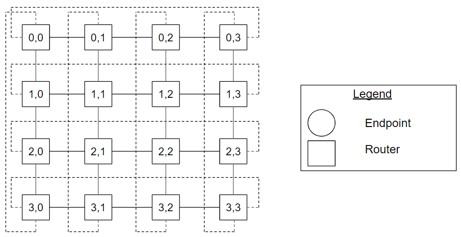
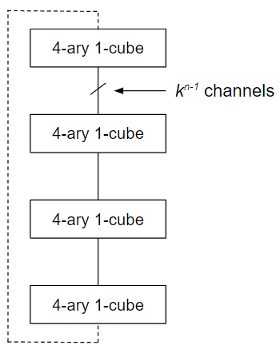
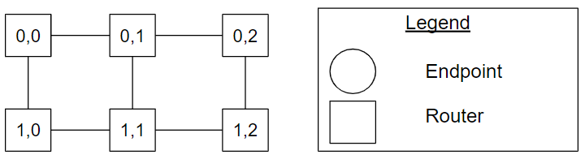

# Dimension-Order Topology Types

## Overview

The dimension-order topology is a topology where the arrangement of the routers
are described by their location in a dimensional space. The topology has a
hierarchical structure where dimension _n_ is composed of structures from
dimension _n-1_. One or more endpoint nodes are connected to a router.

## k-ary n-cube 

A _k_-ary _n_-cube topology consists of _kn_ routers arranged in
an _n_-dimensional cube with _k_ routers along each dimension. Each router is
assigned an _n_-digit radix-_k_ address {an−1, ..., a0}
and is connected to all routers with addresses that differ by ±1(mod _k_) in
exactly one address digit. Each dimension is constructed using _k_ _k_-ary
(_n-1_)-cubes. The channels between the routers can be unidirectional or
bidirectional. In practice, the channels are bidirectional.

### Ring Topology 

**Figure Ring_4ary_1cube_example. A ring
topology with four routers, also known as a 4-ary 1-cube topology.**

The ring topology is a special instance of the _k_-ary _n_-cube, where _n_ is
equal to one. Figure [Ring_4ary_1cube_example](#ring_4ary_1cube_example) shows a
ring topology with four routers, also known as a 4-ary 1-cube topology. The
dotted lines show the connectivity between routers 0 and k-1 for a dimension.

### Symmetric Torus Topology 

**Figure
Symmetric_Torus_4ary_2cube_example.
A symmetric torus topology with four routers along each dimension, also known as
a 4-ary 2-cube topology.**

The symmetric torus topology is a special instance of the _k_-ary _n_-cube,
where n is equal to two. Figure
[Symmetric_Torus_4ary_2cube_example](#symmetric_torus_4ary_2cube_example) shows a
symmetric torus topology with four routers along each dimension, also known as a
4-ary 2-cube topology. Router (3,0) has address 3 in a dimension and 0 in the
other dimension. The dotted lines show the connectivity between routers 0 and
k-1 for a dimension.

**Figure
4ary_2cube_construction_example. The
construction of a symmetric torus (4-ary 2-cube) topology using 4-ary 1-cubes.**

Figure [4ary_2cube_construction_example](#4ary_2cube_construction_example) shows
the construction of a symmetric torus (4-ary 2-cube) topology using 4-ary
1-cubes (ring topologies).

### multi-radix n-cube 

A multi-radix _n_-cube is a generalized form of a _k_-ary _n_-cube topology
where the radix (number of router nodes) for each dimension is explicitly
stated. Each router is assigned an _n_-digit where the digit at index _i_ has
the radix of dimension _i_. A 2,3-ary 2-cube describes a grid-like topology with
a radix of 2 in one dimension and radix of 3 in the other dimension.

**Figure 2,3-ary_2cube_example. A 2,3-ary
2-cube topology example.**

Figure [2,3-ary_2cube_example](#2_3_ary_2cube_example) shows a 2,3-ary 2-cube
topology example. The dotted lines show the connectivity between router 0 and
router radixi - 1 for each dimension.

## k-ary n-mesh 

A _k_-ary _n_-mesh is a _k_-ary _n_-cube topology with the connection from
address ak−1 to address a0 omitted in each dimension.

### Line 

**Figure Line_4ary_1mesh_example. A line
topology with four routers, also known as a 4-ary 1-mesh topology.**

The line topology is a special instance of the _k_-ary _n_-mesh, where _n_ is
equal to one. Figure [Line_4ary_1mesh_example](#line_4ary_1mesh_example) shows a
line topology with four routers, also known as a 4-ary 1-mesh topology. Compared
to the ring topology in Figure
[Ring_4ary_1cube_example](#ring_4ary_1cube_example), the connection from router
0 to router 3 is omitted.

### Symmetric Mesh 

**Figure
Symmetric_Mesh_4ary_2mesh_example. A
symmetric mesh topology with four routers along each dimension, also known as a
4-ary 2-mesh topology.**

The symmetric torus mesh is a special instance of the _k_-ary _n_-mesh, where
_n_ is equal to two. Figure
[Symmetric_Mesh_4ary_2mesh_example](#symmetric_mesh_4ary_2mesh_example) shows a
symmetric mesh topology with four routers along each dimension, also known as a
4-ary 2-mesh topology. Router (1,2) has address 1 in a dimension and 2 in the
other dimension. Compared to the torus topology in Figure
[Symmetric_Torus_4ary_2cube_example](#symmetric_torus_4ary_2cube_example), the
connections between the pair of routers [(0,0), (0,3)], [(1,0), (1,3)], [(2,0),
(2,3)], [(3,0), (3,3)], [(0,0), (3,0)], [(0,1), (3,1)], [(0,2), (3,2)], and
[(0,3), (3,3)] are omitted.

### multi-radix n-mesh 

Similar to the multi-radix _n_-cube, a multi-radix _n_-mesh is a generalized form of
a _k_-ary _n_-mesh topology where the radix (number of router nodes) for each
dimension is explicitly stated. Each router is assigned an _n_-digit where the
digit at index _i_ has the radix of dimension _i_. A 2,3-ary 2-mesh describes a
grid-like topology with a radix of 2 in one dimension and radix of 3 in the
other dimension.

**Figure 2,3-ary_2mesh_example. A 2,3-ary
2-mesh topology example.**

Figure [2,3-ary_2mesh_example](#2_3_ary_2mesh_example) shows a 2,3-ary 2-mesh
topology example. Compared to the multi-radix n-cube topology in Figure
[2,3-ary_2cube_example](#2_3_ary_2cube_example), the connections from the pair
of routers [(0,0), (0,2)], [(1,0), (1,2)], [(0,0), (1,0)], [(0,1), (1,1)] and
[(0,2), (1,2)] are omitted.

## Cheat Sheet

*   A [_k_-ary _n_-cube](#k_ary_n_cube) topology consists of _kn_
    routers arranged in an n-dimensional cube with k router nodes along each
    dimension. Each router is assigned an _n_-digit radix-_k_ address
    {an−1, ..., a0} and is connected to all routers with
    addresses that differ by ±1 (mod k) in exactly one address digit. Each
    dimension is constructed using _k_ _k_-ary (_n_-1)-cubes where there are _k_
    routers in the first dimension.
*   A [multi-radix n-cube](#multi_radix_n_cube) is a generalized form of a
    _k_-ary _n_-cube topology where the radix (number of routers) for each
    dimension is explicitly stated. Each router is assigned an _n_-digit where
    the digit at index _i_ has the radix of dimension _i_.
*   A [_k_-ary _n_-mesh](#k_ary_n_mesh) is a _k_-ary _n_-cube topology with the
    connection from address ak−1 to address a0 omitted in
    each dimension.
*   Similar to the multi-radix _n_-cube, a
    [multi-radix n-mesh](#multi_radix_n_mesh) is a generalized form of a _k_-ary
    _n_-mesh topology where the radix (number of routers) for each dimension is
    explicitly stated. Each router is assigned an _n_-digit where the digit at
    index _i_ has the radix of dimension _i_.
*   Channel direction can be unidirectional or bidirectional.
*   [Ring](#ring): k-ary 1-cube
*   [Symmetric Torus](#symmetric_torus): k-ary 2-cube
*   [Line](#line): k-ary 1-mesh
*   [Symmetric Mesh](#symmetric_mesh): k-ary 2-mesh

## References

William James Dally and Brian Patrick Towles. 2004. Principles and Practices of
Interconnection Networks. Morgan Kaufmann Publishers Inc., San Francisco, CA,
USA.