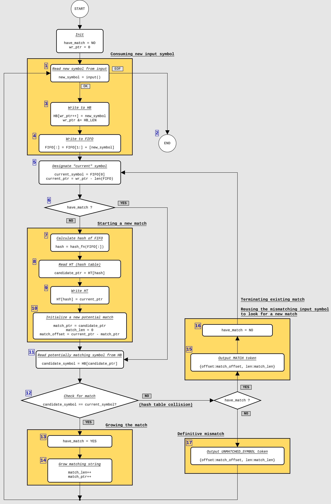
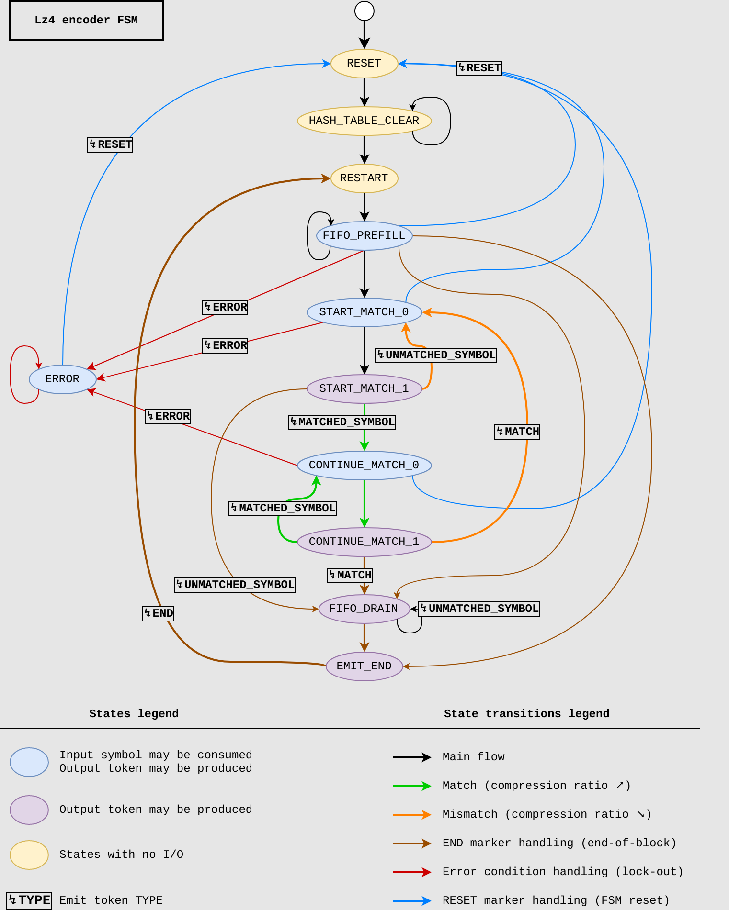

# Dictionary coder implementation in DSLX

Dictionary coder is a compression algorithm that compresses data by replacing
sequences of symbols in original data by pointers to sequences of symbols
stored within a "dictionary" data structure that is known by the decoder.
One example of such algorithms is LZ4.

This module implements encoder and decoder blocks that implement LZ4 algorithm.

## LZ77 algorithms

LZ4 belongs to a broader class of LZ77-like encoders. LZ77 encoders usually
have no preset dictionary and they build dictionary as they compress data. Each
input symbol is thus processed in the context of its own dictionary, and these
dictionaries are in general different for any two symbols. The decoders perform
a reverse process: they almost always start with an empty dictionary and build
it as they are decoding the data, thus obtaining perfect reconstruction not
only of the original raw data that was encoded, but also of the dictionary that
should match the encoder's dictionary at every step.

Within the class of LZ77 algorithms, the dictionary is the buffer which contains
up to `N` past raw symbols that have been already consumed by the encoder, or
emitted by the encoder. Usually it is implemented as a circular buffer, and is
called simply a *history buffer (HB)*.

LZ77 encoder emits two types of tokens (we call them _tokens_ to differentiate
them from _symbols_ which always refer to the original uncompressed data):
- *UNMATCHED_SYMBOL*, which contains the original symbol as-is and which the
  decoder simply copies to the output, resulting in no data size reduction.
- *MATCH*, which tells the decoder to copy a string of symbols from the history
  buffer to the output. As these symbols are not present in the token itself,
  this may result in a significant data size reduction. *MATCH* token contains
  of an *offset-count* pair
  - *Offset* tells the decoder how far back in the history buffer the string
    begins (usually 0 means "start with the last character", 1 is "the one
    before the last", etc.).
  - *Count* tells the decoder how many symbols to copy from the history buffer
    to the output. It's logical that count of `0` results in an empty string,
    thus specific byte-level encoding of the token can instead
    encode `count - 1` value.

## LZ4 algorithm

What puts LZ4 algorithm aside other LZ77-compatible algorithms (such as ALDC)
is how the encoder finds matches in its history buffer. Instead of performing
exhaustive search which is inefficient for algorithms running on the CPU, and
complicated for ASIC implementations (e.g. silicon implementations of ALDC
may use highly-custom CAM memory cores), it performs non-exhaustive search
using a hash table.

LZ4 algorithm uses two random-addressable memory blocks:
1. History buffer (also called *HB RAM*), which is the dictionary itself. HB
   stores raw data symbols, usually using a circular-buffer addressing scheme.
   - HB address bus is *MATCH_OFFSET_WIDTH* bits wide, thus it contains
     up to `(1 << MATCH_OFFSET_WIDTH)` symbols.
   - HB data word contains a single symbol, thus it is *SYMBOL_WIDTH* bits
     wide.
   - The size of the HB RAM is `(1 << MATCH_OFFSET_WIDTH) * SYMBOL_WIDTH` bits.
2. Hash table (also called *HT*). It works as follows:
   - HT address is *HASH_WIDTH* bits wide, this value can be configured to
     slightly tune a footprint-vs-compression ratio tradeoff. The
     address into HT is usually created by hashing a small string that contains
     a small number of symbols (*HASH_SYMBOLS*) extracted in-order from the
     incoming data.
   - HT data word contains a pointer (an address) into the HB RAM at which that
     string of symbols may be found.
   - The size of the HT is `(1 << HASH_WIDTH) * SYMBOL_WIDTH` bits.

In addition, because LZ4 wants to look ahead into the input data to hash it, it
needs a small FIFO with parallel output of all the bits to store *HASH_SYMBOLS*
input symbols and feed them to the hash function.

The flow of operation of LZ4 algorithm is depicted on the flowchart:


A textual expression of it which gives a bit more context:
* __(1)__ Consume one input symbol.
  * __(2)__ If it's an EOF, end processing.
  * Otherwise:
    * __(3)__ Push it to the HB (dropping the oldest symbol from the HB).
    * __(4)__ Push it to the FIFO (dropping the oldest symbol from the FIFO).
* __(5)__ Designate the current oldest symbol in the FIFO as *current_symbol*,
  calculate *current_ptr* - the location of this symbol in the HB.
* __(6)__ If we do not have an existing matching string that we're trying to
  grow, try to start a new matching string:
  * __(7)__ Compute hash of the data contained in the FIFO.
  * __(8)__ Load *candidate_ptr* pointer from the HT.
  * __(9)__ Store *current_ptr* to the HT.
  * __(10)__ Initiate a new matching string: calculate offset from a difference
    of *candidate_ptr* and *current_ptr*, set length to zero.
  * Here, *candidate_ptr* points to the string in history buffer, the
    beginning of which *potentially* matches the current input string which
    starts with *current_symbol* (the first symbols of the current input
    string are stored in the FIFO, and we've just hashed them and performed a
    HT lookup to find a similar sequence of symbols in the HB).
  * The match is not guaranteed since there can be a hash collision - the
    hash is the same, but actual symbols pointed by *candidate_ptr* differ,
    so we need to check each of them if it matches the one in the FIFO.
    In addition to that, we'd like to grow a matching string longer than
    what's contained in the FIFO.
  * As shown below, the same procedure is used to check matching of the
    beginning of the string, as well as of its continuation.
* Here, *current_ptr* points to the *current_symbol* - the next input symbol
  for which no output token has been emitted, while *candidate_ptr* points to
  an old symbol in the HB which we'd like to compare with *current_symbol*.
  * __(11)__ We load a symbol from the HB pointed by *candidate_ptr*, it
    becomes a *candidate_symbol*.
  * __(12)__ The *candidate_symbol* is compared with *current_symbol*.
  * __(13)__ If it's a match, continue this matching string:
    * __(14)__ Increment the match length by 1.
    * Go to step __(1)__ .
  * If it's not a match and we've been already growing a matching string:
    * __(15)__ Emit a *MATCH* token for the current matching string.
    * __(16)__ Terminate current matching string.
    * Go to step __(5)__ - this re-processes current input symbol one more time
      (this is done for two reasons: no output token has been emitted for
      that symbol yet, and it must be emitted at some point, and also
      this symbol may be able to start a new matching string on its own).
  * Otherwise:
    * __(17)__ Emit an *UNMATCHED_SYMBOL* token for the current symbol.
    * Go to step __(1)__.

## DSLX implementation

LZ4 encoder in DSLX is implemented as an FSM-like which changes states at most
once per "tick". It has a form of a _proc_ module.

Compared to the reference flowchart depicted above, this FSM is a bit more
complicated as it has to take into account some corner cases:
* Prefilling the FIFO with data before beginning the processing.
* Correctl handling of current symbol when it runs into an EOF.
* Draining the FIFO after EOF has been observed.
* Allowing "warm" restart of the algorithm after EOF to allow compression of
  *dependent* blocks - that is, without resetting the HT and the HB between the
  blocks (this allows tokens from the curent block to refer HB symbols of the
  previous block).
* System-level integration considerations to allow this block to be chained
  with other XLS-based data pre-/postprocessors:
  * *MATCHED_SYMBOL* tokens. Whenever the encoder adds a symbol to the matching
    string, it emits a *MATCHED_SYMBOL* token, which can be used by the
    postprocessing blocks to reconstruct symbols encoded by *MATCH* tokens
    without having to decode *MATCH*es (such decoding would require a full-size
    history buffer RAM). These tokens should not be stored into the final
    encoded block.
  * Support for a limited form of in-band control signaling via
    *marker tokens*:
    * *END* marker that signals end of block (EOF condition).
    * *ERROR_* family of markers that allow passing error codes between
      processing blocks. These tokens abort the encoding.
    * *RESET* marker that performs a *cold* restart of the encoder (clearing HT
      RAM) and other blocks in the chain, also clearing all error conditions.

One example of a post-processor module can be a *block writer* proc that
gathers tokens produced by the encoder and encodes them using a standardized
byte-oriented *LZ4 Block Format*. Implementation of alternative encoding
schemes may be of interest as well, as the header format used by the standard
LZ4 requires one to know the number of unmatched symbols between two matches
before those symbols are emitted, making bufferless stream processing
difficult.

### Data format

#### PlainData

The encoder consumes a stream of raw symbols, intermixed with control markers.
This is represented using a parametrized `PlainData` DSLX structure:
```rust
pub struct PlainData<DATA_WIDTH: u32> {
    is_marker: bool,
    data: uN[DATA_WIDTH],
    mark: Mark,
}
```

* *is_marker* tells whether this object is a symbol or a marker.
* *data* communicates a symbol whenever *is_marker* is not set.
* *mark* communicates a control mark whenever *is_marker* is set.

#### Token

The encoder produces a stream of tokens. There are four types of them:
* *MATCH* is an *offset-length* pair that represents a sequence of
  symbols that is the same as the specified sequence within HB.
* *UNMATCHED_SYMBOL* represents a symbol for which no match was found in the
  HB. It will be encoded as a raw symbol in the final piece of encoded data.
* *MATCHED_SYMBOL* is a symbol that is encoded within the next *MATCH* token.
  Its intended use is to allow easy postprocessing of a stream of tokens
  without a need for a full-fledged and heavy *MATCH* decoder.
* *MARKER* contains a control mark code.

Tokens are represented using following enum and structure in DSLX:
```rust
pub enum TokenKind : u2 {
    UNMATCHED_SYMBOL = 0,
    MATCHED_SYMBOL = 1,
    MATCH = 2,
    MARKER = 3,
}

pub struct Token<
    SYMBOL_WIDTH: u32, MATCH_OFFSET_WIDTH: u32, MATCH_LENGTH_WIDTH: u32
>{
    kind: TokenKind,
    symbol: uN[SYMBOL_WIDTH],
    match_offset: uN[MATCH_OFFSET_WIDTH],
    match_length: uN[MATCH_LENGTH_WIDTH],
    mark: Mark
}
```

* *kind* specifies one of the four token kinds.
* *symbol* contains symbol value for *UNMATCHED_SYMBOL* and *MATCHED_SYMBOL*
  tokens.
* *match_offset* and *match_length* are valid only for a *MATCH* token:
  * Length is the length of the string that has to be copied from the history
    buffer, minus one. That is, *match_offset=0* specifies a string of 1
    symbol, *match_offset=3* a string of 4 symbols, etc.
  * Offset points to the beginning of the string that has to be copied from
    HB.
    * An offset of 0 means that the first symbol to be copied is the last
      symbol written to the HB - the last symbol emitted when processing the
      previous token.
    * An offset of 1 means starting with the symbol preceding the one for
      offset 0, thus with the second newest symbol in the HB.
  * *MATCH* token may specify *length > offset* - in this case the decoder will
    have to copy not only old symbols, but also symbols produced when handling
    the current *MATCH* token, generating a repetitive sequence of characters,
    which resembles the behavior of a multisymbol *Run-Length Encoder*.

### FSM

A state diagram of the FSM is displayed below:


* **RESET** - the initial state of the decoder. It initializes other state
  variables, resulting in a *cold* block start and jumps to
  **HASH_TABLE_CLEAR**.
  * To facilitate testing in presence of
    [issue #1042](https://github.com/google/xls/issues/1042), there is a proc
    parameter that allows bypassing **HASH_TABLE_CLEAR** and jumping
    directly into the **RESTART** state. It should not be used in real
    implementations as it will make encoding of an independent block to depend
    on the contents of the preceding data blocks, thus making encoding
    non-deterministic and potentially allowing for data leaks across blocks.
* **HASH_TABLE_CLEAR** - encoder iterates here, clearing one word of HT RAM
  per tick.
* **RESTART** - the encoder clears a small set of state variables, resulting in
  a *warm* start, allowing to preserve necessary state (HB, HT) between
  depending data blocks.
* **FIFO_PREFILL** - the encoder fills the input FIFO with symbols.
  * If an *END* token is observed, the FSM will transition into either
    *EMIT_END* or to *FIFO_DRAIN* - this depends on whether the FIFO already
    has multiple symbols in it and thus whether extra ticks are needed to drain
    all of them.
  * Handles input steps of a flowchart: __1, 4__.
* **START_MATCH_0** - roughly corresponds to the *Starting a new match*,
  *Read potential matching symbol from HB*, *Check for match*,
  *Growing the match* parts of the flowchart.
  * Handles input steps: __1, 4__.
  * Handles match steps: __5, 7, 8, 10, 11, 12, 13__.
  * Step __14__ belongs here, but is skipped as an optimization, since step
    __10__ can initialize match variables properly from the start.
* **START_MATCH_1** - "upper" counterpart of **START_MATCH_0**, necessary
  because two accesses to the same (single-port) RAM can not be done in the
  same tick.
  * Handles step __9__, writing to the HT RAM.
  * Handles step __3__, writing to the HB RAM.
  * May emit *UNMATCHED_SYMBOL* token, step __17__.
* **CONTINUE_MATCH_0** - mostly the same as **START_MATCH_0** except that it
  does not start a new match.
  * Handles input steps: __1, 4__.
  * Handles match steps __5, 11, 12, 16__.
* **CONTINUE_MATCH_1** - "upper" counterpart of **CONTINUE_MATCH_0**.
  * Handles step __3__, writing to the HB RAM.
  * May emit *MATCH* token, step __16__.
* **FIFO_DRAIN** - the encoder loops here, draining symbols from the FIFO
  and emitting **UNMATCHED_SYMBOL* tokens for them.
  * Symbols are also written to the HB to make them visible in case a new
    block is started after a *warm* restart.
* **EMIT_END** - the encoder emits a single *END* token and transitions into
  a **RESTART** state.
* **ERROR** - state that is entered whenever the error condition is
  encountered. This can happen if e.g. *ERROR* marker is received from another
  block that precedes the encoder, or if an unknown (unsupported) marker is
  received.
  * The encoder receives and discards incoming symbols, with an exception of
    a *RESET* command marker that is replicated on the output (so  that other
    processing blocks can be reset) and makes FSM transition to the **RESET**
    state.
