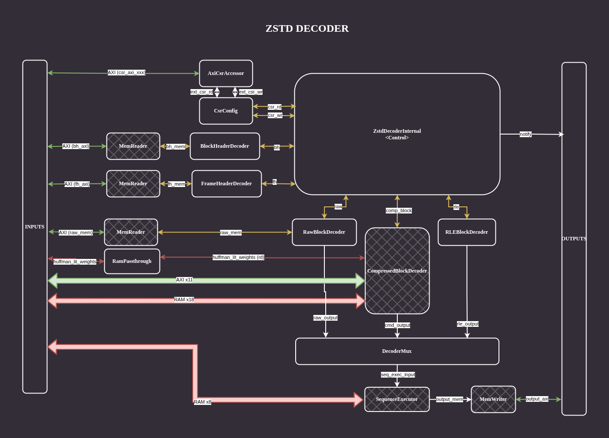
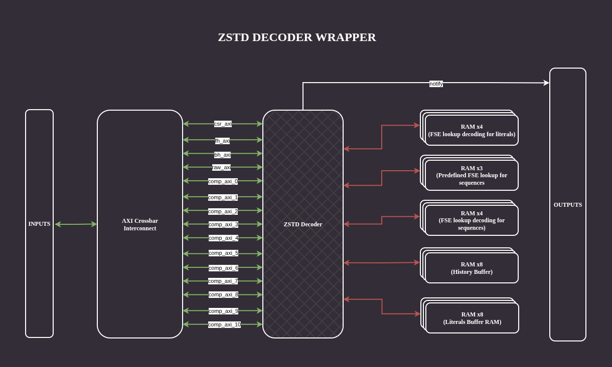
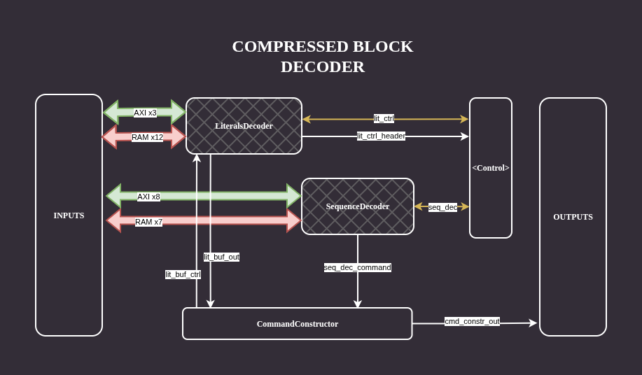
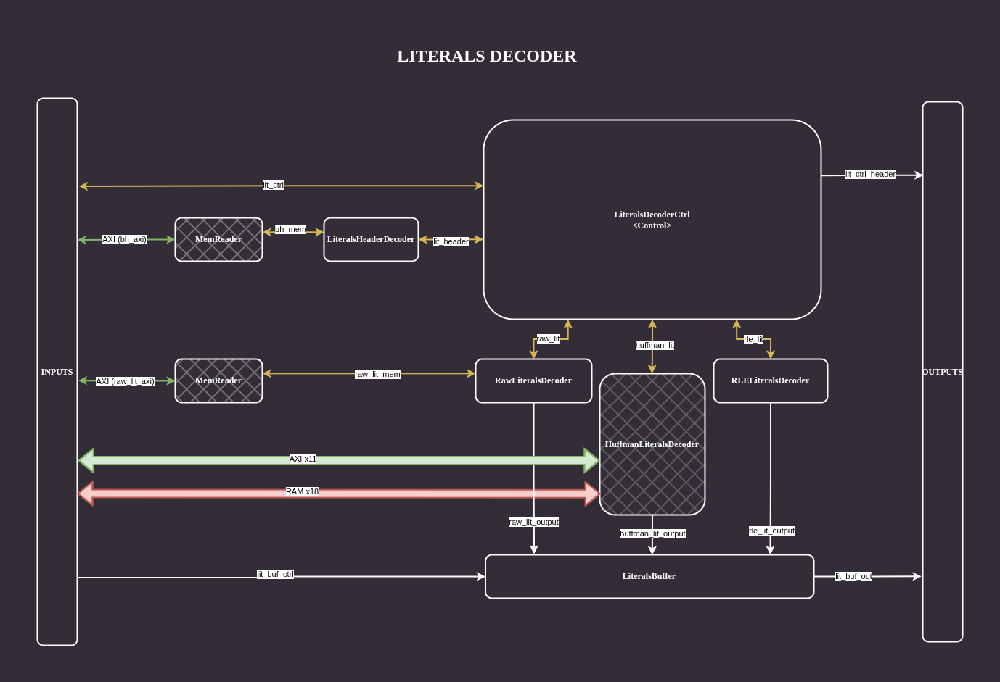
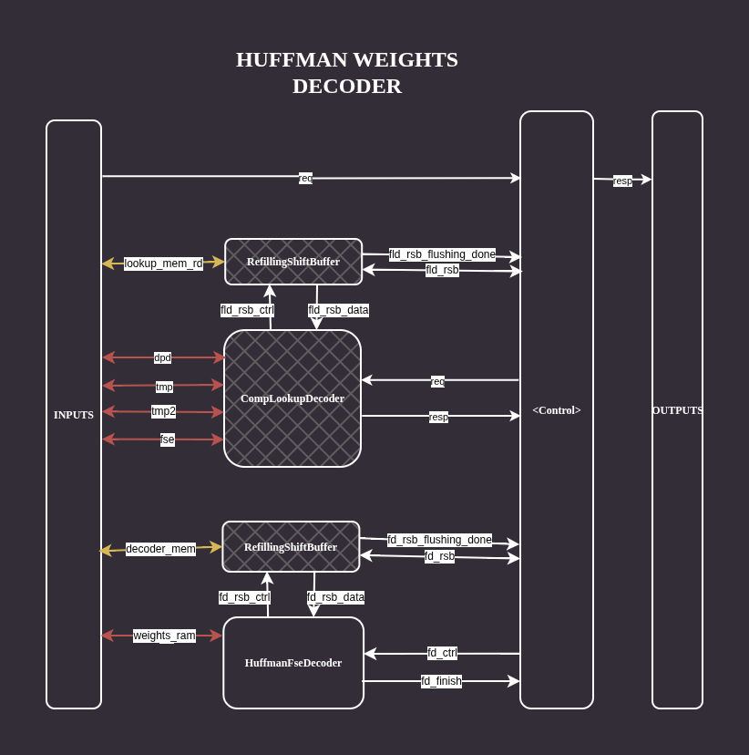

# ZSTD Decoder

The ZSTD Decoder is a hardware module that decompresses Zstandard (ZSTD) frames
that are correctly formed according to the format specified in
[RFC 8878](https://datatracker.ietf.org/doc/html/rfc8878).

# Quickstart

To run the DSLX simulation of the entire ZSTD decoder use:
```
bazel run -- //xls/modules/zstd:zstd_dec_dslx_test --logtostderr
```

The Verilog files can be obtained with:
```
bazel build //xls/modules/zstd:zstd_dec_verilog
```

To run the Verilog simulation with cocotb use:
```
bazel test //xls/modules/zstd:zstd_dec_cocotb_test
```

Note that the generated Verilog alone is not sufficient to use the decoder.
See the [top-level wrapper](#top-level-wrapper) section for details.

# General Overview

This chapter provides a general overview of the ZSTD decoder IO interface,
configuration process and simplified description of it's operation.

## IO Interface

The decoder interacts with the environment via:

- Memory Interface (AXI manager compatible) for reading input frames
  and writing output data
- CSR Interface (AXI subordinate compatible) for configuration and control
- Notify line for signaling completion or errors

Additionally, the ZSTD Decoder requires external RAM memories to store
intermediate results generated during the decompression process.

## Configuration

The decoder is controlled through a set of Control and Status Registers (CSRs),
which are used to:

- Specify adresses of input and output buffers
- Start the decoding process
- Monitor the decoder state

More details abot registers and controling the decoder from software
can be found in [Registers description](#registers-description) and
[Controlling from software](#controlling-from-software).

## Decoding process

Once the decoding process is started, the decoder:

1. Reads the configuration from the CSRs
1. Decodes the Frame Header
1. Decodes the Block Header
1. Runs the dedicated block decoder unit based on the block type
1. Aggregates the processing unit results in the correct order into a stream and routes it to the sequence execution unit
1. Assembles the data block outputs based on the history buffer contents and updates the history
1. Prepares the final output of the decoder and writes it to the memory

# Architecture Overview

This section provides more detailed information about the architecture of
the ZSTD decoder contained in this directory.

## About ZSTD format

A Zstandard file consists of one or more independently decodable frames.
Each frame starts with a magic number followed by a frame header that specifies
decoding parameters, including window size, the presence of a content checksum,
and an optional original content size. Frame data is encoded as
a sequence of blocks, each consisting of a block header and block data.

There are three block types: RAW blocks, which contain uncompressed data;
RLE-compressed blocks, which consist of repetitions of a single symbol;
and compressed blocks, which encode literals and sequences that are used to
restore data using previously decoded bytes.

A compressed block comprises literals and sequences. Literals are data that
cannot be expressed in terms of previously decoded historic data and must be
stored explicitly. There are three types of literals:
RAW, RLE, and Huffman-encoded. The Huffman tree itself can be transmitted in
a raw uncompressed form or in an FSE-compressed form. Sequences describe how to
combine historical data with literals to reconstruct the original block content.
They consist of three values: literal length, match length, and offset.
Sequences are always compressed using FSE, but the FSE decoding tables can be
provided in various forms, including predefined tables from RFC 8878,
or encoded using RLE or FSE.

Decoded sequences and literals are combined in a step called sequence execution,
which uses previously decoded data from a sliding history buffer to restore
the original contents of the block.

There are many additional details required to decode a ZSTD file correctly;
all of them are specified in [RFC 8878](https://datatracker.ietf.org/doc/html/rfc8878).
However, this short description provides enough insight to understand
the ZSTD decoder contained in this directory.

## Top-level overview

The following diagrams presents the top-level view of the ZSTD decoder:


The structure of the decoder reflects the shape of the ZSTD frame.
The similarities between the frame structure are the ZSTD decoder could be
seen on every level of the design hierarchy.

At the top level, the `ZstdDecoderInternal` proc encapsulates the control logic
for the entire decoding pipeline. It starts with reading the csr configuration
that carries the information about the addresses of the input and output buffers.
Then the main part of the decompression starts.

First the control block invkes the `FrameHeaderDecoder` to extract the basic
properties of the encoded file and to verify that the decoder can process it.
Besides the standard requirement for a decoder to have sufficient size of
the history buffer (configurable), this implementation requires also
information about the decompressed frame size.

This component, like many others in the system, accesses input data through
a `MemoryReader`, which fetches data directly over the system bus.
For each block, the control logic triggers decoding of the block header via
the `BlockHeaderDecoder` followed by execution of the corresponding block decoder.
The selected block decoder produces input for the `SequenceExecutor`,
which is responsible for executing the decoded sequences.

Two types of packets can be sent to the sequence execution stage:
- Packets generated by RAW and RLE block decoders, containing literals
  that are directly copied to both the history buffer and the output.
- Packets generated by compressed block decoder, which require
  history-buffer lookups during sequence execution.

The fully decompressed frame is emitted from the `SequenceExecutor` and written
to memory using the `MemoryWriter`, which stores the output via the system bus.

## Top-level wrapper

Note that the design generated from the ZstdDecoder top-module is not sufficient
to run the design in hardware, as the decoder requires external RAMs.
Because of that a simple wrapper is provided in the `rtl` directory.

Additionally the wrapper is used to transalte the signals generated from
XLS channels to output matching with AXI interfaces. All the external
interfaces are collected with a third party
[AXI interconnect](https://github.com/alexforencich/verilog-axi), so that
the design exposes only two interfaces - one for subordinate
and the other for manager site of the bus.

The diagram below shows the structure of the Verilog wrapper:


## Description of individual modules

### ZstdDecoderInternal

This process implements the main control logic for the decoder and manages
the entire decompression flow. It uses configuration data from the CSRs,
coordinates all internal modules, and issues processing requests according to
the current state. The state machine below defines the steps involved in
processing a ZSTD frame:


### AxiCsrAccessor

This proc provides an AXI interface to the CSRs of the Decoder.
Any read / write operation on the AXI is translated to a read / write operation
on the CSRs.

### CsrConfig

This proc implements the Control and Status Registers (CSRs). It's responsible
for storing the state of the registers and handling read / write operations.

### FrameHeaderDecoder

This proc receives the address of the start of a ZSTD frame, reads the frame
data from memory, and parses the frame header. If the magic number is invalid
or the header is corrupted, it responds with an error code. Otherwise,
it converts the header into an internal DSLX representation, calculates its
length, and responds with `OKAY` status.

### BlockHeaderDecoder

It extracts the block type, size, and whether it is the last block in the frame,
and returns this information in the response.
ZSTD block headers are 3 bytes, but this proc always reads 4 bytes.
The extra byte is included to optimize processing for the RleBlockDecoder.

### DecoderMux

This stage collects outputs from `RAW`, `RLE`, or `CompressedBlockDecoder`
and forwards them to the history buffer and command execution stage.
Streams are processed in ID order assigned by the top-level proc.
Each decoder sends a single ID until the last packet of the block.
The aggregator waits for the expected ID, reads it until the last signal,
then moves to the next ID, starting from 0 and wrapping back after both `last`
and `last_block` are set.

### RamPassthrough

This proces is a simple wrapper for routing both read and write side of
RAM interface through a single proc, so the ram rewritting step available
in XLS toolchain can rewrite it to proper RAM interface in verilog.

### SequenceExecutor

This block is responsible for managing `HistoryBuffer` using the data obtained
from `RawBlockDecoder`, `RleBlockDecoder` and `CompressBlockDecoder`.
The data comming from RAW and RLE block are sent directy to the output and
history buffer. Wheras data from `CompressBlockDecoder` (sequences and literals)
are processed first in the
[sequence execution](https://datatracker.ietf.org/doc/html/rfc8878#name-sequence-execution) step.

### RawBlockDecoder

This proc forwards the block data directly to its output channel.
It preserves the block ID and tags all data as literals to be placed
unchanged in the history buffer.

### RleBlockDecoder

This proc receives a tuple `(s, N)` where `s` is an 8-bit symbol and `N` is
the repeat count. The symbol is provided by `BlockHeaderDecoder`.
The proc outputs `N` repetitions of the symbol, preserves the block ID,
and tags all outputs as literals.

### CompressBlockDecoder

This proc includes the `LiteralsDecoder` and `SequenceDecoder`,
which decode literals and sequences, along with control logic that manages
the decompression process. Both decoders use multiple sub-procs.

The diagram below illustrates the structure of the `CompressedBlockDecoder`:


## LiteralsDecoder

LiteralsDecoder block is used to decode literals, it comprises of a
dedicated `LiteralsHeaderDecoder` responsible for decoding the header of the
literals section, `RawLiteralsDecoder`, `RleLiteralsDecoder` and `HuffmanLiteralsDecoder`
for decoding three types of the literals that can be present in the literals section
and `LiteralsBuffer` for storing the decoded literals. The control
logic controling the decoding process is encapsulated in `LiteralsDecoderCtrl` block



## RawLiteralsDecoder

This proc is responsible for fetching literals from a given address in memory
and streaming them out as literal tokens.

## RleLiteralsDecoder

This proc expands repeated symbols into literal data. On request, it receives
the information about the symbol to be repeated and the regenerated size.
It streams the symbol multiple times to satisfy the regenerated size.

## HuffmanLiteralsDecoder

This is a module that wires together procs needed to decode Huffman-encoded
literals: `HuffmanControlAndSequence`, `HuffmanWeightsDecoder`, `WeightPreScan`,
`WeightCodeBuilder`, `HuffmanDataPreprocessor`, `HuffmanDecoder`, along with
procs needed for memory access.

## HuffmanWeightsDecoder

This proc decodes Huffman tree weights from memory. It supports both RAW and
FSE formats. It fetches the Huffman tree description from memory, decodes it,
and writes the decoded weights into an internal RAM.



## LiteralsBuffer

This module provides interfaces to store and retrieve literals. It handles all
types of decoded literals (RAW, RLE, and Huffman), and stores them in RAM. The
module offers a uniform interface to access these literals, treating all types
consistently.

## SequenceDecoder

This proc is responsible for decoding sequences. Its work consists of decoding
the sequence header and decoding FSE lookups for LL, OF and ML into execution
commands.


# Registers description

The ZSTD Decoder operation is based on the values stored in a set of CSRs
accessible to the user through the AXI bus. The registers are defined below:

| Register      | Address | Description                        |
|---------------|---------|------------------------------------|
| Status        | 0x00    | Current decoder state              |
| Start         | 0x08    | Write 1 in IDLE to start decoding  |
| Input Buffer  | 0x10    | Base address of input frame        |
| Output Buffer | 0x18    | Base address of output buffer      |

### Status codes

The following is a list of all available status codes that can be written in the
`Status` register.

| Name                                 | Value | Description                                       |
|--------------------------------------|-------|-------------------------------------------------- |
| IDLE                                 | 0     | Decoder idle, waiting for configuration and start |
| RUNNING                              | 1     | Decoding in progress                              |
| READ_CONFIG_OK                       | 2     | Configuration read successfully                   |
| FRAME_HEADER_OK                      | 3     | Frame header decoded                              |
| FRAME_HEADER_CORRUPTED               | 4     | Invalid frame header                              |
| FRAME_HEADER_UNSUPPORTED_WINDOW_SIZE | 5     | Unsupported window size                           |
| BLOCK_HEADER_OK                      | 6     | Block header decoded                              |
| BLOCK_HEADER_CORRUPTED               | 7     | Reserved block type                               |
| BLOCK_HEADER_MEMORY_ACCESS_ERROR     | 8     | Memory access error                               |
| RAW_BLOCK_OK                         | 9     | RAW block decoded                                 |
| RAW_BLOCK_ERROR                      | 10    | RAW block memory error                            |
| RLE_BLOCK_OK                         | 11    | RLE block decoded                                 |

# Controlling from software

Software configuration must be performed while the decoder is in
the `IDLE` state, which is the only state in which CSRs are read and applied.
The software should first read the `Status` register to confirm the IDLE state.
It must then allocate memory for the input buffer, write the ZSTD frame to it,
and store its base address in the `Input Buffer` register.
Next, the software must allocate memory for the output buffer and writes
its base address to the `Output Buffer` register.

Decoding is started by writing `1` to the `Start` register.
The decoder reads the configuration, transitions to the RUNNING state,
and begins decoding the input data. Upon successful completion,
the decoder returns to the `IDLE` state, asserts the `Notify` IRQ line,
and writes the decoded data to the output buffer. If an error occurs,
the decoder asserts the `Notify` IRQ line and writes the corresponding error
code to the `Status` register.

# Testing methodology

Testing is performed at two levels: decoder components and the
integrated decoder.

Individual components are tested using DSLX tests on various,
usually small inputs that test dedicated scenarios. Most of the proc should
have dedicated tests in DSLX.

Integration tests for the entire decoder are performed at both
DSLX and Verilog levels by comparing the decoder output against
the ZSTD reference library. Due to limitations of the frame generator,
only valid ZSTD frames are currently tested.

Verilog tests use [cocotb](https://github.com/cocotb/cocotb) testbenches
with [cocotbext-axi](https://github.com/alexforencich/cocotbext-axi) extension
to model AXI memory and interact with CSR interfaces. The AXI manager from
the cocotb extension is used to interface with the decoder's CSRs
to simulate software control.

A basic integration test:

1. Generates a ZSTD frame using [decodecorpus](https://github.com/facebook/zstd/blob/dev/tests/decodecorpus.c)
1. Places the frame in AXI-connected memory.
1. Produces the expected output using the original [zstd library](https://github.com/facebook/zstd).
1. Configures and starts the decoder via CSRs.
1. Waits for `Notify` signal and compares memory output with the expected result.
1. Checks that the decoder returns to `IDLE` state with a `OKAY` in the `Status` CSR

## Failure points

The tests report a failure if any of the following conditions occur:

- The top-level state machine enters the `ERROR` state due
  to corrupted input data.
- An `assert!()` or `fail!()` is triggered during simulation,
  indicating an internal error or incorrect decoder configuration.
- The decoded output size or content differs from the output of the reference
  zstd library.
- Intermediate decoding results are incorrect, such as an invalid FSE table or
  incorrect Huffman weights or codes.
- The input data requires a larger history buffer than supported by
  the current decoder configuration, indicating a mismatch between
  the test file and decoder setup.

### Failures trigered by internal components

Some errors, such as invalid magic numbers or frame headers, can be triggered
by modifying generated ZSTD frames. However most errors require deeper changes
to the compressed frame, so DSLX component tests are preferred for focused testing.

Components may trigger `assert!()` or `fail!()` or propagate error states to
the top-level controller, causing it to enter the `ERROR` state.
In this state, the decoder writes an error code to the `Status` CSR and
asserts the `Notify` signal.

The `ERROR` state can occur under these conditions:
- Frame header corruption
  - Invalid magic number (not 0xFD2FB528)
  - Reserved bit set
  - Window size exceeding `WINDOW_LOG_MAX` (0x78000000)
- Block header corruption
  - Block type set to `RESERVED`
- Raw block memory access error

Assertions and failures occur in the following modules:

- `DecoderMux`: `ExtendedBlockDataPacket` with an ID less than any previously processed packet, or missing ID 0 at the start of a frame
- `HuffmanDecoder` when input data cause invalid state transition
- `HuffmanFseDecoder` when the FSE-encoded stream of weight contains 8 or more bits of padding
- `AxiCsrAccessor` on access to non-existing CSR
- `CompLookupDecoder` when the accuracy log of FSE table to decode is bigger then the maximal allowed value
- `FseTableCreator` when thee corruption is detected during decoding of FSE lookup
- `FseDecoder` when the FSE-encoded stream of sequences contains 8 or more bits of padding
- `RefillingShiftBuffer` when internal state of the proc is incorrect

Several `impossible cases` are also covered by `fail!()`, they should never
be triggered and were added to satisfy the type checking system.
