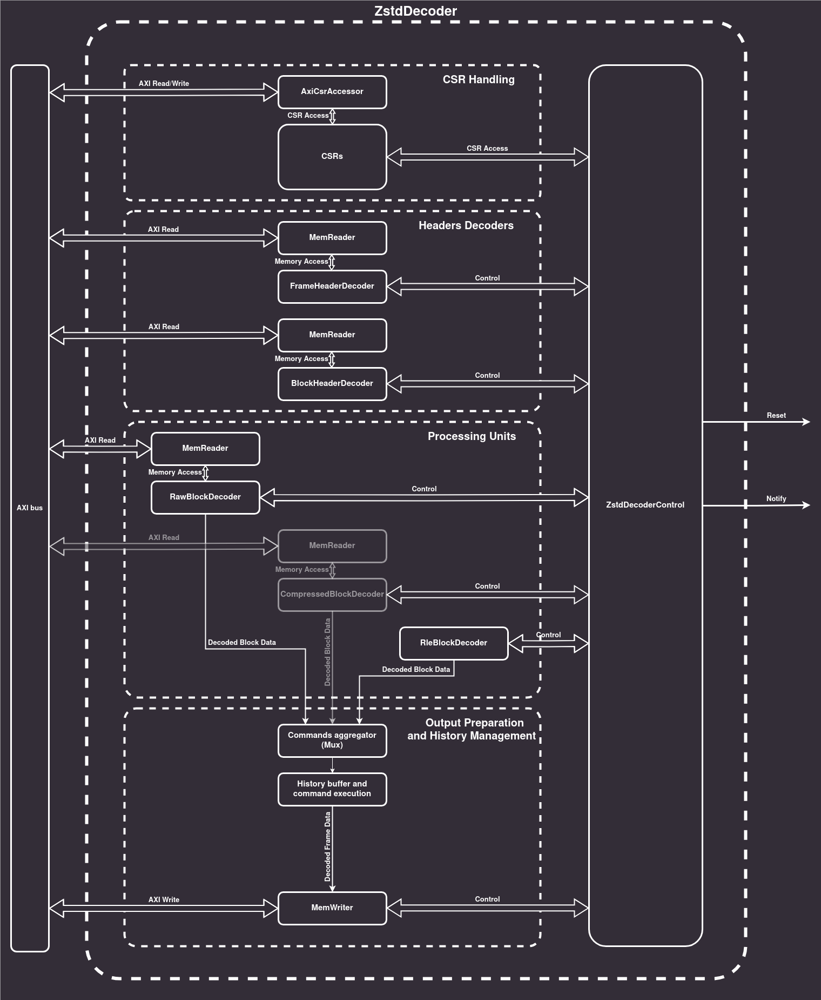
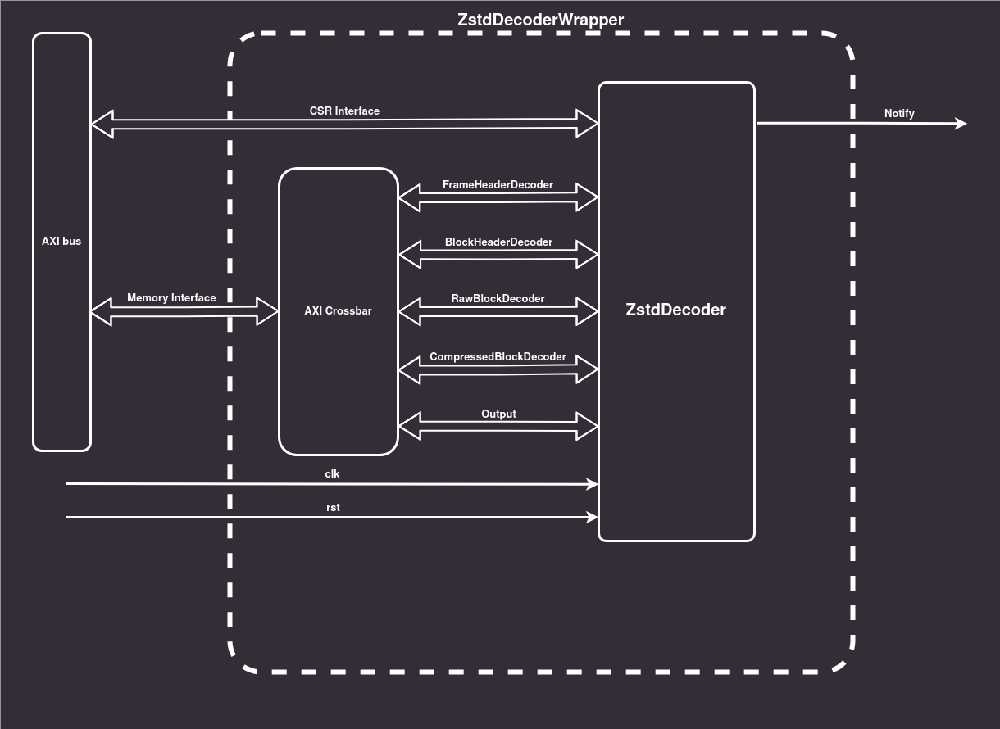

# ZSTD decoder

The ZSTD decoder decompresses the correctly formed ZSTD frames and blocks. It
implements the [RFC 8878](https://www.rfc-editor.org/rfc/rfc8878.html)
decompression algorithm. An overview of the decoder architecture is presented in
the diagram below. The decoder comprises:

* Memory Readers
* Memory Writer,
* Control and Status Registers,
* Frame Header Decoder,
* Block Header Decoder,
* 3 types of processing units: RAW-, RLE-, and Compressed Block Decoders[^1],
* Command Aggregator,

The Decoder interacts with the environment through a set of ports:

* Memory Interface (AXI)
* CSR Interface (AXI)
* Notify line

The software controls the core through registers accessible through the `CSR
Interface`. The CSRs are used to configure the decoder and to start the decoding
process.

ZSTD frames to decode are placed in a memory that should be connected to
decoder's `Memory Interface`.

Once the decoding process is started, the decoder:

1.  Reads the configuration from the CSRs,
2.  Decodes the Frame Header,
3.  Decodes the Block Header,
4.  Decodes the Block Data with the correct processing unit picked based on the
    Block Type from the Block Header,
5.  Aggregates the processing unit results in the correct order into a stream
    and routes it to the history buffer,
6.  Assembles the data block outputs based on the history buffer contents and
    updates the history,
7.  Prepares the final output of the decoder and writes it to the memory,
8.  (Optional) Calculates checksum and compares it against the checksum read
    from the frame.[^2]



## Registers description

The ZSTD Decoder operation is based on the values stored in a set of CSRs
accessible to the user through the AXI bus. The registers are defined below:

| Name | Address | Description |
| ---- | ------- | ----------- |
| Status | 0x0 | Keeps the code describing the current state of the ZSTD Decoder |
| Start | 0x8 | Writing `1` when the decoder is in the `IDLE` state starts the decoding process |
| Input Buffer | 0x10 | Keeps the base address for the input buffer that is used for storing the frame to decode |
| Output Buffer | 0x18 | Keeps the base address for the output buffer, ZSTD Decoder will write the decoded frame into memory starting from this address. |

### Status codes

The following is a list of all available status codes that can be written in the
`Status` register.

| Name | Value | Description |
| ---- | ------- | ----------- |
| IDLE | 0 | Previous decoding finished successfully. The decoder waits for the configuration and writes to the `Start` register. |
| RUNNING | 1 | Decoding process is started |
| READ_CONFIG_OK |2 | Successfully read configuration from the CSRs |
| FRAME_HEADER_OK | 3 | Successfully decoded frame header |
| FRAME_HEADER_CORRUPTED | 4 | Frame header data is not valid |
| FRAME_HEADER_UNSUPPORTED_WINDOW_SIZE | 5 | The `WindowSize` parameter read from the frame header is not supported in the decoder |
| BLOCK_HEADER_OK | 6 | Successfully read the header of the Zstd data block |
| BLOCK_HEADER_CORRUPTED | 7 | Block type is `Reserved` |
| BLOCK_HEADER_MEMORY_ACCESS_ERROR | 8 | Failure in communication with the memory |
| RAW_BLOCK_OK | 9 | Successfully decoded raw data block |
| RAW_BLOCK_ERROR | 10 | Failure in communication with the memory |
| RLE_BLOCK_OK | 11 | Successfully decoded RLE data block |

## Controlling the decoder from the software

The configuration done by the software must be carried out when the decoder is
in the `IDLE` state. It is the only time when the decoder will be able to take
the configuration values from the CSRs and use those in the decoding process.

The software should first read the `Status` register to confirm that the decoder
is in the `IDLE` state.

Then, the software has to reserve the memory for the input buffer and write the
frame to decode there. The address of the buffer should be written into `Input
Buffer` register so that the decoder will know where to look for the frame to
decode.

The next step is to reserve the memory space for the decoded frame where the
Decoder will write the decompressed data. The address to that buffer should be
written to the `Output Buffer` register.

Finally, it is possible to start the decoding process by writing `1` to the
`Start` register. This orders the Decoder to read the configuration CSRs and
start reading and decoding data stored in the input buffer. The Decoder
transitions to the `RUNNING` state and then to other states that describe the
status of the last operation finished in the decoder (see #status-codes for
other possible status codes) which will be visible in the `Status` register.

When the decoding process is finished the Decoder transitions back to the `IDLE`
state and signals this on the `Notify` IRQ line. The decoded data is stored
under the address configured previously in the `Output Buffer` register.

In case an error occurs during the decoding process it is also signaled on the
`Notify` IRQ line and the error code is written to the `Status` CSR.

## ZSTD decoder architecture

### Top level Proc

This state machine is responsible for controlling the operation of the whole
decoder. It uses the configuration data from the CSRs, connects all underlying
modules and sends processing requests to those based on the state of the
machine. The states defined for the processing of the ZSTD frame are as follows:


After going through the initial stage of reading the configuration from the
CSRs, the decoder sends the processing requests to the underlying parts of the
decoder. The processing requests contain the addresses in the memory where
particular parts of the encoded ZSTD frames reside. The decoder, based on
responses from consecutive internal modules, calculates offsets from the base
address that was written to `Input Buffer` CSR and forms the requests for the
next internal modules, e.g.: for `BlockHeaderDecoder` or any of the processing
units (`RawBlockDecoder`, `RleBlockDecoder`, `CompressedBlockDecoder`).

Each of the internal modules waits for the processing request. Once received,
the module fetches the data from the memory starting from the address received
in the processing request. `MemReader` procs are used by those modules to
communicate with the external memory through the AXI interface. Internal modules
decode the acquired parts of the frame and return responses with the results
back to the top level proc.

The processing units also output the decoded blocks of data through a
stream-based interface to the `SequenceExecutor` proc. This proc performs the
last step of the decoding before the final output is sent out back to the memory
under the address stored in the `Output Buffer` CSR by the `MemWriter` proc.
Once the decoding process is completed and the decoded frame is written back to
the memory, the decoder sends the `Notify` signal and transitions back to the
`IDLE` state.

### Internal modules

#### FrameHeaderDecoder

This proc receives requests with the address of the beginning of the ZSTD frame.
It then reads the frame data from the memory and starts parsing the frame
header. If the magic number is not detected or the frame header is invalid, the
proc will send a response with an error code. Otherwise, it will put the frame
header into internal DSLX representation, calculate the length of the header and
send those as a response with `OKAY` status.

#### BlockHeaderDecoder

ZSTD block header size is always 3 bytes. BlockHeaderDecoder always reads 4
bytes of data. It extracts the information on block type, size and whether the
block is the last one in the ZSTD frame and puts that data in the response. The
additional byte is also placed in the response as an optimization for the
RleBlockDecoder.

#### RawBlockDecoder

This proc passes the data read from the memory directly to its output channel.
It preserves the block ID and attaches a tag, stating that the data contains
literals and should be placed in the history buffer unchanged, to each data
output.

#### RleBlockDecoder

This proc receives a tuple (s, N), where s is an 8-bit symbol and N is an
accompanying `symbol_count`. It does not have to read the 8-bit symbol from the
memory because `BlockHeaderDecoder` did that before and passed the symbol in the
processing request to the `RleBlockDecoder`. The proc produces `N*s` repeats of
the given symbol. This step preserves the block ID and attaches the literals tag
to all its outputs.

#### CompressedBlockDecoder[^1]

This part of the design is responsible for decoding the compressed data blocks.
It ingests the bytes stream, and internally translates and interprets incoming
data. Only this part of the design creates data chunks tagged both with
`literals` and/or `copy`. This step preserves the block ID. More in-depth
description can be found in [Compressed block decoder
architecture](#compressed-block-decoder-architecture1) paragraph of this doc.

#### Commands aggregator (DecMux)

This stage takes the output from either RAW, RLE or CompressedBlockDecoder and
sends it to the History buffer and command execution stage. This stage orders
streams based on the ID value assigned by the top level proc. It is expected
that single base decoders (RAW, RLE, compressed block decoder) will be
continuously transmitting a single ID to the point of sending the `last` signal
which marks the last packet of currently decoded block. That ID can change only
when mux receives the `last` signal or `last` and `last_block` signals.

It works as a priority mux that waits for a stream with the expected ID. It
continues to read that stream until the `last` signal is set, then it switches
to the next stream ID.

The command aggregator starts by waiting for `ID = 0`, after receiving the
`last` signal it expects `ID = 1` and so on. Only when both `last` and
`last_block` are set the command aggregator will wait for `ID = 0`.

#### History buffer and command execution (SequenceExecutor)

This stage receives data which is tagged either `literals` or `copy`. This stage
will show the following behavior, depending on the tag:

* `literals`
    *   Packet contents placed as newest in the history buffer,
    *   Packet contents copied to the decoder's output,
* `copy`
    *   Wait for all previous writes to be completed,
    *   Copy `copy_length` literals starting `offset _length` from the newest in
        history buffer to the decoder's output,
    *   Copy `copy_length` literals starting `offset _length` from the newest in
        history buffer to the history buffer as the newest.

### Compressed block decoder architecture[^1] {#compressed-block-decoder-architecture1}

This part of the design is responsible for processing the compressed blocks up
to the `literals`/`copy` command sequence. This sequence is then processed by
the history buffer to generate the expected data output. An overview of the
architecture is provided in the diagram below. The architecture is split into 2
paths: the literals path and the sequence path. Architecture is split into 3
paths: literals path, FSE encoded Huffman trees and sequence path. Literals path
uses Huffman trees to decode some types of compressed blocks: Compressed and
Treeless blocks.


#### Compressed block dispatcher

This proc parses literals section headers to calculate block compression format,
Huffmman tree size (if applicable based on compression format), compressed and
regenerated sizes for literals. If compressed block format is
`Compressed_Literals_Block`, dispatcher reads Huffman tree header byte from
Huffman bitstream, and directs expected number of bytes to the Huffman tree
decoder. Following this step, the proc sends an appropriate number of bytes to
the literals decoder dispatcher.

After sending literals to literals decompression, it redirects the remaining
bytes to the sequence parsing stages.

#### Command Constructor

This stage takes literals length, offset length and copy length. When `literals
length` is greater than 0, it will send a request to the literals buffer to
obtain `literals length` literals and then send them to the history buffer. Then
based on the offset and copy length it either creates a match command using the
provided offset and match lengths, or uses repeated offset and updates the
repeated offset memory. Formed commands are sent to the Commands aggregator
(mux).

#### Literals path architecture


##### Literals decoder dispatcher

This proc parses and consumes the literals section header. Based on the received
values it passes the remaining bytes to RAW/RLE/Huffman tree/Huffman code
decoders. It also controls the 4 stream operation mode [4-stream mode in
RFC](https://www.rfc-editor.org/rfc/rfc8878.html#name-jump_table).

All packets sent to the Huffman bitstream buffer will be tagged either
`in_progress` or `finished`. If the compressed literals use the 4 streams
encoding, the dispatcher will send the `finished` tag 4 times, each time a fully
compressed stream is sent to the bitstream buffer.

##### RAW Literals

This stage simply passes the incoming bytes as literals to the literals buffer.

##### RLE Literals

This stage works similarly to the [RLE stage](#rleblockdecoder) for RLE data
blocks.

##### Huffman bitstream buffer

This stage takes data from the literals decoder dispatcher and stores it in the
buffer memory. Once the data with the `finished` tag set is received, this stage
sends a tuple containing (start, end) positions for the current bitstream to the
Huffman codes decoder. This stage receives a response from the Huffman codes
decoder when decoding is done and all bits got processed. Upon receiving this
message, the buffer will reclaim free space.

##### Huffman codes decoder

This stage receives bitstream pointers from the Huffman bitstream buffer and
Huffman tree configuration from the Huffman tree builder. It accesses the
bitstream buffers memory to retrieve bitstream data in reversed byte order and
runs it through an array of comparators to decode Huffman code to correct
literals values.

##### Literals buffer

This stage receives data either from RAW, RLE or Huffman decoder and stores it.
Upon receiving the literals copy command from the Command Constructor for `N`
number of bytes, it provides a reply with `N` literals.

#### FSE Huffman decoder architecture


##### Huffman tree decoder dispatcher

This stage parses and consumes the Huffman tree description header. Based on the
value of the Huffman descriptor header, it passes the tree description to the
FSE decoder or to direct weight extraction.

##### FSE weight decoder

This stage performs multiple functions.

1.  It decodes and builds the FSE distribution table.
2.  It stores all remaining bitstream data.
3.  After receiving the last byte, it translates the bitstream to Huffman
    weights using 2 interleaved FSE streams.

##### Direct weight decoder

This stage takes the incoming bytes and translates them to the stream of Huffman
tree weights. The first byte of the transfer defines the number of symbols to be
decoded.

##### Weight aggregator

This stage receives tree weights either from the FSE decoder or the direct
decoder and transfers them to Huffman tree builder. This stage also resolves the
number of bits of the final weight and the max number of bits required in the
tree representation. This stage will emit the weights and number of symbols of
the same weight before the current symbol for all possible byte values.

##### Huffman tree builder

This stage takes `max_number_of_bits` (maximal length of Huffman code) as the
first value, then the number of symbols with lower weight for each possible
weight (11 bytes), followed by a tuple (number of preceding symbols with the
same weight, symbol's_weight). It's expected to receive weights for all possible
byte values in the correct order. Based on this information, this stage will
configure the Huffman codes decoder.

#### Sequence path architecture


##### Sequence Header parser and dispatcher

This stage parses and consumes `Sequences_Section_Header`. Based on the parsed
data, it redirects FSE description to the FSE table decoder and triggers
Literals FSE, Offset FSE or Match FSE decoder to reconfigure its values based on
the FSE table decoder. After parsing the FSE tables, this stage buffers
bitstream and starts sending bytes, starting from the last one received as per
ZSTD format. Bytes are sent to all decoders at the same time. This stage
monitors and triggers sequence decoding phases starting from initialization,
followed by decode and state advance. FSE decoders send each other the number of
bits they read.

##### Literals FSE decoder

This stage reconfigures its FSE table when triggered from [sequence header parse
and dispatcher](#sequence-header-parser-and-dispatcher). It initializes its
state as the first FSE decoder. In the decode phase, this stage is the last one
to decode extra raw bits from the bitstream, and the number of ingested bits is
transmitted to all other decoders. This stage is the first stage to get a new
FSE state from the bitstream, and it transmits the number of bits it used.

##### Offset FSE decoder

This stage reconfigures its FSE table when triggered from [sequence header parse
and dispatcher](#sequence-header-parser-and-dispatcher). It initializes its
state as the second FSE decoder. In the decode phase, this stage is the first
one to decode extra raw bits from bitstream, and the number of ingested bits is
transmitted to all other decoders. This stage is the last decoder to update its
FSE state after the decode phase, and it transmits the number of used bits to
other decoders.

##### Match FSE decoder

This stage reconfigures its FSE table when triggered from [sequence header parse
and dispatcher](#sequence-header-parser-and-dispatcher). It initializes its
state as the last FSE decoder. In the decode phase, this stage is the second one
to decode extra raw bits from the bitstream, and the number of ingested bits is
transmitted to all other decoders. This stage is the second stage to update its
state after the decode phase, and the number of used bits is sent to all other
decoders.

## Testing methodology

Testing of the `ZSTD decoder` is carried out on two levels:

* Decoder components
* Integrated decoder

Each component of the decoder is tested individually in DSLX tests. Testing on
the DSLX level allows the creation of small test cases that test for positive
outcomes of a given part of the design. When need be, those test cases can be
also modified by the user to better understand how the component operates.

Tests of the integrated ZSTD decoder are carried out on DSLX and Verilog levels.
The objective of those is to verify the functionality of the decoder as a whole.
Testing setup for the ZSTD decoder is based on comparing the simulated decoding
results against the decoding of the reference library. Currently, due to the
restrictions from the ZSTD frame generator, it is possible to test only the
positive cases (decoding valid ZSTD frames).

Verilog tests are written in Python as
[cocotb](https://github.com/cocotb/cocotb) testbench.

ZstdDecoder's main communication interfaces are the AXI buses. Due to the way
XLS handles the codegen of DSLX channels that model the AXI channels, the
particular ports of the AXI channels are not represented correctly. This
enforces the introduction of a Verilog wrapper that maps the ports generated by
XLS into proper AXI ports (see AXI peripherals [README](memory/README.md) for
more information). Additionally, the wrapper is used to mux multiple AXI
interfaces from `Memory Readers` and `Memory Writer` into a single
outside-facing AXI interface (`Memory Interface`) that can be connected to the
external memory. The mux is implemented by a third-party [AXI
Crossbar](https://github.com/alexforencich/verilog-axi).



**Figure: Zstd decoder wrapper connection diagram.**

Cocotb testbench interacts with the decoder with the help of a
[cocotbext-axi](https://github.com/alexforencich/cocotbext-axi) extension that
provides AXI bus models, drivers, monitors and RAM model accessible through AXI
interface. Cocotb AXI Manager is connected to the decoder's `CSR Interface` and
is used to simulate the software's interaction with the decoder.

The Basic test case for the ZstdDecoder is composed of the following steps:

1. The testbench generates a ZSTD frame using the
   [decodecorpus](https://github.com/facebook/zstd/blob/dev/tests/decodecorpus.c)
   utility from the [zstd reference library](https://github.com/facebook/zstd).
2. The encoded frame is placed in an AXI RAM model that is connected to the
   decoder's `Memory Interface`.
3. The encoded frame is decoded with the zstd reference library and the results
   are represented in the decoder's output format as the expected data from the
   simulation.
4. AXI Manager performs a series of writes to the ZstdDecoder CSRs to configure
   it and start the decoding process.
5. Testbench waits for the signal on the `Notify` channel and checks the output
   of the decoder stored in the memory against the expected output data.
6. Test case succeeds once `Notify` is asserted, all expected data is received
   and the decoder lands in `IDLE` state with status `OKAY` in the `Status` CSR.

### Failure points

#### User-facing decoder errors

The design will fail the tests under the following conditions:

* Straightforward failures:
  * Top Level State Machine transitions to `ERROR` state
  * Simulation encounters `assert!()` or `fail!()` statements
  * The decoding result from the simulation has a different size than the
    results from the reference library
  * The decoding result from the simulation has different contents than the
    results from the reference library

Currently, all mentioned conditions lead to an eventual test failure.

#### Failures in ZSTD Decoder components

It is important to note that some of the errors (e.g. errors in magic number or
frame header decoding) are easy to trigger in the integration test cases by
manual modification of the generated ZSTD frames. However, the majority of the
errors require modification of the deeper parts of the raw ZSTD frame which is
significantly harder. Because of that, it is better to rely on DSLX tests for
the individual components where inputs for the test cases are smaller, easier to
understand and modify when needed.

The components of the ZSTD decoder can fail on `assert!()` and `fail!()`
statements or propagate specific error states to the Top Level Proc and cause it
to transition to the `ERROR` state. Upon entering the `ERROR` state, the decoder
will write a specific error code to the `Status` CSR and send a `Notify` signal
to the output. The interacting software can then read the code from the register
and properly handle the error.

The following enumeration will describe how to trigger each possible ZSTD
Decoder error.

The `ERROR` state can be encountered under the following conditions when running
Top Level Proc Verilog tests but also in DSLX tests for the specific components:

* Corrupted data on the frame header decoding stage
  * Provide data for the decoding with the first 4 bytes not being the valid
`Magic Number` (0xFD2FB528)
  * Set the `Reserved bit` in the frame header descriptor
  * Set `Window Size` in frame header to value greater than `max window size`
calculated from current `WINDOW_LOG_MAX` (by default in Top Level Proc tests
`Window Size` must be greater than `0x78000000` to trigger the error)
* Corrupted data during Block Header decoding
  * Set the `Block Type` of any block in the ZSTD frame to `RESERVED`

The `assert!()` or `fail!()` will occur in:

*   RawBlockDecoder
    *   Receive `BlockDataPacket` with `ID` different than the previous packet
        which did not have the `last` flag set
*   DecoderMux
    *   At the beginning of the simulation or after receiving
        `ExtendedBlockDataPacket` with `last` and `last_block` (decoding new
        ZSTD frame) set receive on channels `raw_r`, `rle_r` and `cmp_r`
        `ExtendedBlockDataPackets` without any of those having `ID==0`
    *   Receive `ExtendedBlockDataPacket` with a smaller `ID` than any of the
        previously processed packets during the current ZSTD frame decoding
*   SequenceExecutor
    *   Receive `SequenceExecutorPacket` with `msg_type==SEQUENCE` and `content`
        field with value: `0`

There are also several `impossible cases` covered by `fail!()`.
Those are mostly enforced by the type checker for the `match` expressions to
cover unreachable cases.
This is done for example in:

* Frame header decoder
* SequenceExecutor

### Testing against [libzstd](https://github.com/facebook/zstd)

Design is verified by comparing decoding results to the reference library
`libzstd`. ZSTD frames used for testing are generated with
[decodecorpus](https://github.com/facebook/zstd/blob/dev/tests/decodecorpus.c)
utility. The generated frame is then decoded with `libzstd` and with simulated
`ZstdDecoder`.

#### Positive test cases

If the results of decoding with `libzstd` are valid, the test runs the same
encoded frame through the simulation of DSLX design. The output of the
simulation is gathered and compared with the results of `libzstd` in terms of
its size and contents.

Encoded ZSTD frame is generated with the function `GenerateFrame(seed, btype,
output_path)` from
[data_generator](https://github.com/antmicro/xls/blob/main/xls/modules/zstd/cocotb/data_generator.py)
library. This function takes as arguments the seed for the generator, an enum
that codes the type of blocks that should be generated in a given frame and the
output path to write the generated frame into a file. The available block types
are:

* RAW
* RLE
* COMPRESSED
* RANDOM

The function returns a vector of bytes representing a valid encoded ZSTD frame.
Such generated frame can be passed to DSLX and cocotb testbenches to be decoded
in the simulation and compared against the results from the reference library.

Verilog tests are available in the `zstd_dec_cocotb_test.py` file and can be
launched with the following Bazel command:

```shell
bazel run -c opt -- //xls/modules/zstd:zstd_dec_cocotb_test --logtostderr
```

#### Negative test cases

Currently, `decodecorpus` does not support generating ZSTD frames with subtle
errors that trigger failure points provided in the ZSTD Decoder. Because of
that, it is not possible to efficiently provide valuable negative tests for the
integrated ZSTD Decoder.

The alternatives for writing negative tests include:

* Generating a well-known valid ZSTD frame from a specific generator seed and
then tweaking the raw bits in this frame to trigger the error response from the
decoder

[^1]: `CompressedBlockDecoder` is to be added in follow-up PRs.
[^2]: Checksum verification is currently unsupported.
